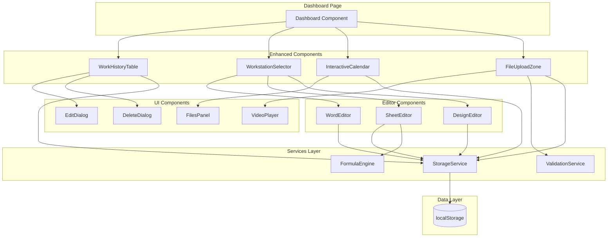

# Design Document: Enhanced Dashboard Workstation

## Overview

The Enhanced Dashboard Workstation feature transforms the existing Dashboard from a display-only interface into a fully interactive workspace. This enhancement enables users to create, edit, and manage work entries directly within the dashboard, providing functional workstation editors (Word, Sheet, Design), an interactive calendar with file viewing capabilities, and comprehensive video support.

### Key Objectives

- Enable direct editing and deletion of work history entries
- Provide fully functional rich text, spreadsheet, and design editors
- Implement interactive calendar with date-specific file viewing
- Support video file uploads and Google Drive video links
- Ensure all data persists reliably to localStorage
- Maintain responsive, accessible UI/UX patterns

### Technology Stack

- **Frontend Framework**: React 18 with TypeScript
- **Build Tool**: Vite
- **UI Components**: shadcn/ui (Radix UI primitives)
- **Styling**: Tailwind CSS
- **Animations**: Framer Motion
- **Rich Text Editor**: TipTap (React wrapper for ProseMirror)
- **Spreadsheet**: Custom implementation with formula evaluation
- **Storage**: localStorage with JSON serialization
- **Video Playback**: HTML5 video element with custom controls

## Architecture

### High-Level Architecture



### Component Hierarchy

```
Dashboard
├── WorkHistoryTable
│   ├── WorkEntryCard (with edit/delete actions)
│   ├── EditWorkEntryDialog
│   └── DeleteConfirmationDialog
├── WorkstationSelector
│   ├── WordEditor (TipTap)
│   ├── SheetEditor (Custom Grid)
│   └── DesignEditor (Canvas/Notes)
├── InteractiveCalendar
│   └── DateFilesPanel
│       ├── FilePreviewCard
│       └── VideoPlayer
└── FileUploadZone
    ├── VideoUploadHandler
    ├── GoogleDriveLinkInput
    └── VideoPlayer
```

### Data Flow

1. **Work Entry Management Flow**
   - User hovers over work entry → Display action buttons
   - User clicks edit → Load entry data into EditDialog
   - User submits changes → StorageService updates localStorage
   - WorkHistoryTable refreshes → Display updated data

2. **Editor Save Flow**
   - User creates content in editor → Local state updates
   - User clicks save → StorageService serializes and stores data
   - Success confirmation displayed → Editor resets

3. **Calendar File Viewing Flow**
   - User clicks calendar date → StorageService queries files by date
   - Files found → Display FilesPanel with file list
   - User clicks file → Open/download file or play video

4. **Video Upload Flow**
   - User drops/selects video → ValidationService checks format and size
   - Valid video → Upload to StorageService with date association
   - Display video preview with VideoPlayer component

## Components and Interfaces

### 1. Enhanced WorkHistoryTable Component

**Purpose**: Display work history with edit and delete capabilities

**Props Interface**:
```typescript
interface WorkHistoryTableProps {
  // No props - manages its own state
}
```

**State Management**:
```typescript
interface WorkHistoryState {
  workEntries: WorkEntry[];
  searchTerm: string;
  sortBy: 'name' | 'date';
  editingEntry: WorkEntry | null;
  deletingEntryId: string | null;
}
```

**Key Features**:
- Hover-triggered action buttons (edit, delete)
- Inline search and sort functionality
- Edit dialog with form validation
- Delete confirmation dialog
- Real-time updates after mutations

**Component Structure**:
```typescript
const WorkHistoryTable: React.FC = () => {
  const [workEntries, setWorkEntries] = useState<WorkEntry[]>([]);
  const [editingEntry, setEditingEntry] = useState<WorkEntry | null>(null);
  const [deletingEntryId, setDeletingEntryId] = useState<string | null>(null);
  
  // Load entries from storage on mount
  useEffect(() => {
    const entries = storageService.getWorkEntries();
    setWorkEntries(entries);
  }, []);
  
  const handleEdit = (entry: WorkEntry) => {
    setEditingEntry(entry);
  };
  
  const handleSaveEdit = (updatedEntry: WorkEntry) => {
    storageService.updateWorkEntry(updatedEntry);
    setWorkEntries(storageService.getWorkEntries());
    setEditingEntry(null);
  };
  
  const handleDelete = (id: string) => {
    storageService.deleteWorkEntry(id);
    setWorkEntries(storageService.getWorkEntries());
    setDeletingEntryId(null);
  };
  
  return (
    <Card>
      {/* Search and sort controls */}
      {/* Work entry cards with hover actions */}
      <EditWorkEntryDialog 
        entry={editingEntry} 
        onSave={handleSaveEdit}
        onCancel={() => setEditingEntry(null)}
      />
      <DeleteConfirmationDialog
        isOpen={!!deletingEntryId}
        onConfirm={() => handleDelete(deletingEntryId!)}
        onCancel={() => setDeletingEntryId(null)}
      />
    </Card>
  );
};
```

### 2. WordEditor Component

**Purpose**: Rich text document creation and editing

**Props Interface**:
```typescript
interface WordEditorProps {
  documentId?: string; // For loading existing documents
  onSave: (content: string) => void;
  onCancel: () => void;
}
```

**State Management**:
```typescript
interface WordEditorState {
  content: string;
  isSaving: boolean;
  lastSaved: Date | null;
}
```

**Rich Text Features**:
- Bold, italic, underline formatting
- Headings (H1, H2, H3)
- Bullet and numbered lists
- Text alignment (left, center, right, justify)
- Undo/redo functionality
- Auto-save draft to localStorage

**Implementation Details**:
- Uses TipTap editor (React wrapper for ProseMirror)
- Toolbar with formatting buttons
- Real-time content preview
- JSON serialization for storage

**Component Structure**:
```typescript
const WordEditor: React.FC<WordEditorProps> = ({ documentId, onSave, onCancel }) => {
  const editor = useEditor({
    extensions: [
      StarterKit,
      TextAlign.configure({ types: ['heading', 'paragraph'] }),
    ],
    content: documentId ? storageService.getDocument(documentId) : '',
  });
  
  const handleSave = () => {
    if (editor) {
      const content = editor.getHTML();
      onSave(content);
    }
  };
  
  return (
    <div className="word-editor">
      <EditorToolbar editor={editor} />
      <EditorContent editor={editor} />
      <div className="actions">
        <Button onClick={handleSave}>Save</Button>
        <Button variant="outline" onClick={onCancel}>Cancel</Button>
      </div>
    </div>
  );
};
```

### 3. SheetEditor Component

**Purpose**: Spreadsheet with cells and formula support

**Props Interface**:
```typescript
interface SheetEditorProps {
  spreadsheetId?: string;
  onSave: (data: SpreadsheetData) => void;
  onCancel: () => void;
}
```

**State Management**:
```typescript
interface SheetEditorState {
  cells: Record<string, CellData>; // e.g., { "A1": { value: "100", formula: null } }
  selectedCell: string | null;
  rows: number;
  cols: number;
}

interface CellData {
  value: string;
  formula: string | null;
  computed: string | number | null;
}
```

**Formula Support**:
- Basic arithmetic: +, -, *, /
- Functions: SUM, AVERAGE, MIN, MAX
- Cell references: A1, B2, etc.
- Range references: A1:A10

**Implementation Details**:
- Grid rendered with CSS Grid
- Click to select cell, double-click to edit
- Formula evaluation engine
- Dependency tracking for cell updates

**Component Structure**:
```typescript
const SheetEditor: React.FC<SheetEditorProps> = ({ spreadsheetId, onSave, onCancel }) => {
  const [cells, setCells] = useState<Record<string, CellData>>({});
  const [selectedCell, setSelectedCell] = useState<string | null>(null);
  
  const handleCellChange = (cellId: string, value: string) => {
    const newCells = { ...cells };
    
    if (value.startsWith('=')) {
      // Formula
      const computed = formulaEngine.evaluate(value, cells);
      newCells[cellId] = { value, formula: value, computed };
    } else {
      // Plain value
      newCells[cellId] = { value, formula: null, computed: value };
    }
    
    setCells(newCells);
  };
  
  const handleSave = () => {
    onSave({ cells, rows: 20, cols: 10 });
  };
  
  return (
    <div className="sheet-editor">
      <div className="grid">
        {/* Render cells */}
      </div>
      <div className="actions">
        <Button onClick={handleSave}>Save</Button>
        <Button variant="outline" onClick={onCancel}>Cancel</Button>
      </div>
    </div>
  );
};
```

### 4. DesignEditor Component

**Purpose**: Canvas or notes interface for design work

**Props Interface**:
```typescript
interface DesignEditorProps {
  designId?: string;
  onSave: (content: DesignContent) => void;
  onCancel: () => void;
}
```

**State Management**:
```typescript
interface DesignEditorState {
  mode: 'canvas' | 'notes';
  canvasData: string; // Base64 encoded image
  notesContent: string;
}
```

**Features**:
- Toggle between canvas and notes mode
- Canvas: Basic drawing tools (pen, eraser, colors)
- Notes: Rich text area for design documentation
- Export canvas as PNG

**Component Structure**:
```typescript
const DesignEditor: React.FC<DesignEditorProps> = ({ designId, onSave, onCancel }) => {
  const [mode, setMode] = useState<'canvas' | 'notes'>('notes');
  const [canvasData, setCanvasData] = useState<string>('');
  const [notesContent, setNotesContent] = useState<string>('');
  const canvasRef = useRef<HTMLCanvasElement>(null);
  
  const handleSave = () => {
    onSave({ mode, canvasData, notesContent });
  };
  
  return (
    <div className="design-editor">
      <div className="mode-toggle">
        <Button onClick={() => setMode('canvas')}>Canvas</Button>
        <Button onClick={() => setMode('notes')}>Notes</Button>
      </div>
      
      {mode === 'canvas' ? (
        <canvas ref={canvasRef} />
      ) : (
        <Textarea value={notesContent} onChange={(e) => setNotesContent(e.target.value)} />
      )}
      
      <div className="actions">
        <Button onClick={handleSave}>Save</Button>
        <Button variant="outline" onClick={onCancel}>Cancel</Button>
      </div>
    </div>
  );
};
```

### 5. Enhanced InteractiveCalendar Component

**Purpose**: Calendar with date-specific file viewing

**Props Interface**:
```typescript
interface InteractiveCalendarProps {
  // No props - manages its own state
}
```

**State Management**:
```typescript
interface CalendarState {
  currentDate: Date;
  selectedDate: string | null;
  filesForDate: FileMetadata[];
  showFilesPanel: boolean;
}
```

**Key Features**:
- Visual indicators on dates with files
- Click date to open files panel
- Slide-over panel with file list
- File preview thumbnails
- Click file to open/download

**Component Structure**:
```typescript
const InteractiveCalendar: React.FC = () => {
  const [selectedDate, setSelectedDate] = useState<string | null>(null);
  const [filesForDate, setFilesForDate] = useState<FileMetadata[]>([]);
  const [showFilesPanel, setShowFilesPanel] = useState(false);
  
  const handleDateClick = (dateStr: string) => {
    const files = storageService.getFilesByDate(dateStr);
    setFilesForDate(files);
    setSelectedDate(dateStr);
    setShowFilesPanel(files.length > 0);
  };
  
  return (
    <Card>
      {/* Calendar grid */}
      <Sheet open={showFilesPanel} onOpenChange={setShowFilesPanel}>
        <SheetContent>
          <DateFilesPanel 
            date={selectedDate} 
            files={filesForDate}
            onClose={() => setShowFilesPanel(false)}
          />
        </SheetContent>
      </Sheet>
    </Card>
  );
};
```

### 6. Enhanced FileUploadZone Component

**Purpose**: File upload with video support and Google Drive links

**Props Interface**:
```typescript
interface FileUploadZoneProps {
  // No props - manages its own state
}
```

**State Management**:
```typescript
interface FileUploadState {
  files: FileUpload[];
  isDragging: boolean;
  uploadProgress: Record<string, number>;
  googleDriveLink: string;
}

interface FileUpload {
  id: string;
  file: File;
  type: 'video' | 'document' | 'image';
  preview?: string;
  status: 'pending' | 'uploading' | 'complete' | 'error';
}
```

**Video Support**:
- Accepted formats: MP4, WebM, AVI, MOV
- Max file size: 100MB
- Upload progress indicator
- Video preview after upload

**Google Drive Integration**:
- URL validation (must be drive.google.com)
- Reject YouTube, Facebook, TikTok, Instagram
- Embedded Google Drive player
- Link stored with metadata

**Component Structure**:
```typescript
const FileUploadZone: React.FC = () => {
  const [files, setFiles] = useState<FileUpload[]>([]);
  const [googleDriveLink, setGoogleDriveLink] = useState('');
  
  const handleFileDrop = (droppedFiles: File[]) => {
    const validated = droppedFiles.map(file => ({
      id: generateId(),
      file,
      type: getFileType(file),
      status: 'pending' as const,
    })).filter(f => validationService.validateFile(f.file));
    
    setFiles(prev => [...prev, ...validated]);
  };
  
  const handleGoogleDriveLink = () => {
    if (validationService.validateGoogleDriveUrl(googleDriveLink)) {
      storageService.saveGoogleDriveLink(googleDriveLink, new Date().toISOString());
      setGoogleDriveLink('');
    } else {
      toast.error('Invalid Google Drive link');
    }
  };
  
  return (
    <Card>
      {/* Drag and drop zone */}
      {/* Google Drive link input */}
      {/* File list with video previews */}
    </Card>
  );
};
```

### 7. VideoPlayer Component

**Purpose**: Video playback with standard controls

**Props Interface**:
```typescript
interface VideoPlayerProps {
  src: string;
  type: 'file' | 'google-drive';
  onError?: (error: string) => void;
}
```

**Features**:
- Play/pause control
- Volume control
- Fullscreen toggle
- Progress bar with seek
- Duration and current time display
- Error handling with user-friendly messages

**Component Structure**:
```typescript
const VideoPlayer: React.FC<VideoPlayerProps> = ({ src, type, onError }) => {
  const videoRef = useRef<HTMLVideoElement>(null);
  const [isPlaying, setIsPlaying] = useState(false);
  const [currentTime, setCurrentTime] = useState(0);
  const [duration, setDuration] = useState(0);
  
  const handlePlayPause = () => {
    if (videoRef.current) {
      if (isPlaying) {
        videoRef.current.pause();
      } else {
        videoRef.current.play();
      }
      setIsPlaying(!isPlaying);
    }
  };
  
  return (
    <div className="video-player">
      {type === 'file' ? (
        <video ref={videoRef} src={src} onError={() => onError?.('Failed to load video')} />
      ) : (
        <iframe src={src} allowFullScreen />
      )}
      <div className="controls">
        {/* Play/pause, volume, progress bar, fullscreen */}
      </div>
    </div>
  );
};
```


## Data Models

### WorkEntry Model

Represents a work history entry that can be edited and deleted.

```typescript
interface WorkEntry {
  id: string;                    // Unique identifier (UUID)
  name: string;                  // Work entry name/title
  fileId: string;                // File identifier
  format: string;                // File format (PDF, DOCX, etc.)
  date: string;                  // ISO date string (YYYY-MM-DD)
  size: string;                  // Human-readable size (e.g., "2.4 MB")
  content?: string;              // Optional content reference
  createdAt: string;             // ISO timestamp
  updatedAt: string;             // ISO timestamp
}
```

**Storage Key**: `casi360_work_entries`

**Example**:
```json
{
  "id": "550e8400-e29b-41d4-a716-446655440000",
  "name": "Q4 Financial Report",
  "fileId": "FIN-2024-Q4",
  "format": "PDF",
  "date": "2024-02-20",
  "size": "2.4 MB",
  "createdAt": "2024-02-20T10:30:00Z",
  "updatedAt": "2024-02-20T10:30:00Z"
}
```

### Document Model (Word)

Represents a rich text document created in the Word editor.

```typescript
interface Document {
  id: string;                    // Unique identifier
  title: string;                 // Document title
  content: string;               // HTML content from TipTap
  contentJson: object;           // TipTap JSON format for editing
  createdAt: string;             // ISO timestamp
  updatedAt: string;             // ISO timestamp
  author: string;                // User identifier
}
```

**Storage Key**: `casi360_documents`

**Example**:
```json
{
  "id": "doc-001",
  "title": "Project Proposal",
  "content": "<h1>Project Proposal</h1><p>This is the content...</p>",
  "contentJson": {
    "type": "doc",
    "content": [
      { "type": "heading", "attrs": { "level": 1 }, "content": [{ "type": "text", "text": "Project Proposal" }] }
    ]
  },
  "createdAt": "2024-02-20T14:00:00Z",
  "updatedAt": "2024-02-20T15:30:00Z",
  "author": "user-123"
}
```

### Spreadsheet Model (Sheet)

Represents a spreadsheet with cells and formulas.

```typescript
interface Spreadsheet {
  id: string;                    // Unique identifier
  title: string;                 // Spreadsheet title
  cells: Record<string, CellData>; // Cell data by cell ID (e.g., "A1")
  rows: number;                  // Number of rows
  cols: number;                  // Number of columns
  createdAt: string;             // ISO timestamp
  updatedAt: string;             // ISO timestamp
  author: string;                // User identifier
}

interface CellData {
  value: string;                 // Raw value or formula
  formula: string | null;        // Formula if starts with "="
  computed: string | number | null; // Computed result
  format?: CellFormat;           // Optional formatting
}

interface CellFormat {
  bold?: boolean;
  italic?: boolean;
  align?: 'left' | 'center' | 'right';
  backgroundColor?: string;
}
```

**Storage Key**: `casi360_spreadsheets`

**Example**:
```json
{
  "id": "sheet-001",
  "title": "Budget 2024",
  "cells": {
    "A1": { "value": "Item", "formula": null, "computed": "Item" },
    "B1": { "value": "Cost", "formula": null, "computed": "Cost" },
    "A2": { "value": "Rent", "formula": null, "computed": "Rent" },
    "B2": { "value": "1000", "formula": null, "computed": 1000 },
    "A3": { "value": "Utilities", "formula": null, "computed": "Utilities" },
    "B3": { "value": "200", "formula": null, "computed": 200 },
    "B4": { "value": "=SUM(B2:B3)", "formula": "=SUM(B2:B3)", "computed": 1200 }
  },
  "rows": 20,
  "cols": 10,
  "createdAt": "2024-02-20T09:00:00Z",
  "updatedAt": "2024-02-20T11:00:00Z",
  "author": "user-123"
}
```

### Design Model

Represents design work (canvas or notes).

```typescript
interface Design {
  id: string;                    // Unique identifier
  title: string;                 // Design title
  mode: 'canvas' | 'notes';      // Design mode
  canvasData: string | null;     // Base64 encoded PNG (if canvas mode)
  notesContent: string | null;   // Rich text notes (if notes mode)
  createdAt: string;             // ISO timestamp
  updatedAt: string;             // ISO timestamp
  author: string;                // User identifier
}
```

**Storage Key**: `casi360_designs`

**Example**:
```json
{
  "id": "design-001",
  "title": "UI Mockup",
  "mode": "notes",
  "canvasData": null,
  "notesContent": "Design notes for the new dashboard layout...",
  "createdAt": "2024-02-20T16:00:00Z",
  "updatedAt": "2024-02-20T16:45:00Z",
  "author": "user-123"
}
```

### FileMetadata Model

Represents uploaded files and Google Drive links.

```typescript
interface FileMetadata {
  id: string;                    // Unique identifier
  name: string;                  // File name
  type: 'video' | 'document' | 'image' | 'google-drive-link';
  format: string;                // File format (MP4, PDF, etc.)
  size: number;                  // File size in bytes
  sizeFormatted: string;         // Human-readable size
  url: string;                   // File URL or Google Drive link
  thumbnail?: string;            // Preview thumbnail (base64 or URL)
  uploadDate: string;            // ISO date string (YYYY-MM-DD)
  uploadTimestamp: string;       // ISO timestamp
  metadata?: VideoMetadata | DocumentMetadata;
}

interface VideoMetadata {
  duration: number;              // Duration in seconds
  width: number;                 // Video width
  height: number;                // Video height
  codec?: string;                // Video codec
}

interface DocumentMetadata {
  pageCount?: number;            // Number of pages
  author?: string;               // Document author
}
```

**Storage Key**: `casi360_files`

**Example (Video File)**:
```json
{
  "id": "file-001",
  "name": "presentation-recording.mp4",
  "type": "video",
  "format": "MP4",
  "size": 52428800,
  "sizeFormatted": "50 MB",
  "url": "blob:http://localhost:5173/abc123",
  "uploadDate": "2024-02-20",
  "uploadTimestamp": "2024-02-20T13:00:00Z",
  "metadata": {
    "duration": 300,
    "width": 1920,
    "height": 1080
  }
}
```

**Example (Google Drive Link)**:
```json
{
  "id": "file-002",
  "name": "Training Video",
  "type": "google-drive-link",
  "format": "Google Drive",
  "size": 0,
  "sizeFormatted": "N/A",
  "url": "https://drive.google.com/file/d/1abc123/view",
  "uploadDate": "2024-02-20",
  "uploadTimestamp": "2024-02-20T14:00:00Z"
}
```

### DateFilesIndex Model

Maps dates to file IDs for efficient calendar queries.

```typescript
interface DateFilesIndex {
  [date: string]: string[];      // Date (YYYY-MM-DD) -> Array of file IDs
}
```

**Storage Key**: `casi360_date_files_index`

**Example**:
```json
{
  "2024-02-20": ["file-001", "file-002", "file-003"],
  "2024-02-21": ["file-004"],
  "2024-02-22": ["file-005", "file-006"]
}
```

## API/Service Layer Design

### StorageService

Centralized service for all localStorage operations with error handling and data validation.

```typescript
class StorageService {
  private readonly KEYS = {
    WORK_ENTRIES: 'casi360_work_entries',
    DOCUMENTS: 'casi360_documents',
    SPREADSHEETS: 'casi360_spreadsheets',
    DESIGNS: 'casi360_designs',
    FILES: 'casi360_files',
    DATE_FILES_INDEX: 'casi360_date_files_index',
  };

  // Work Entries
  getWorkEntries(): WorkEntry[] {
    return this.getItem<WorkEntry[]>(this.KEYS.WORK_ENTRIES, []);
  }

  addWorkEntry(entry: Omit<WorkEntry, 'id' | 'createdAt' | 'updatedAt'>): WorkEntry {
    const entries = this.getWorkEntries();
    const newEntry: WorkEntry = {
      ...entry,
      id: this.generateId(),
      createdAt: new Date().toISOString(),
      updatedAt: new Date().toISOString(),
    };
    entries.push(newEntry);
    this.setItem(this.KEYS.WORK_ENTRIES, entries);
    return newEntry;
  }

  updateWorkEntry(entry: WorkEntry): void {
    const entries = this.getWorkEntries();
    const index = entries.findIndex(e => e.id === entry.id);
    if (index !== -1) {
      entries[index] = { ...entry, updatedAt: new Date().toISOString() };
      this.setItem(this.KEYS.WORK_ENTRIES, entries);
    }
  }

  deleteWorkEntry(id: string): void {
    const entries = this.getWorkEntries();
    const filtered = entries.filter(e => e.id !== id);
    this.setItem(this.KEYS.WORK_ENTRIES, filtered);
  }

  // Documents
  getDocuments(): Document[] {
    return this.getItem<Document[]>(this.KEYS.DOCUMENTS, []);
  }

  getDocument(id: string): Document | null {
    const docs = this.getDocuments();
    return docs.find(d => d.id === id) || null;
  }

  saveDocument(doc: Omit<Document, 'id' | 'createdAt' | 'updatedAt'>): Document {
    const docs = this.getDocuments();
    const newDoc: Document = {
      ...doc,
      id: this.generateId(),
      createdAt: new Date().toISOString(),
      updatedAt: new Date().toISOString(),
    };
    docs.push(newDoc);
    this.setItem(this.KEYS.DOCUMENTS, docs);
    return newDoc;
  }

  updateDocument(doc: Document): void {
    const docs = this.getDocuments();
    const index = docs.findIndex(d => d.id === doc.id);
    if (index !== -1) {
      docs[index] = { ...doc, updatedAt: new Date().toISOString() };
      this.setItem(this.KEYS.DOCUMENTS, docs);
    }
  }

  // Spreadsheets
  getSpreadsheets(): Spreadsheet[] {
    return this.getItem<Spreadsheet[]>(this.KEYS.SPREADSHEETS, []);
  }

  getSpreadsheet(id: string): Spreadsheet | null {
    const sheets = this.getSpreadsheets();
    return sheets.find(s => s.id === id) || null;
  }

  saveSpreadsheet(sheet: Omit<Spreadsheet, 'id' | 'createdAt' | 'updatedAt'>): Spreadsheet {
    const sheets = this.getSpreadsheets();
    const newSheet: Spreadsheet = {
      ...sheet,
      id: this.generateId(),
      createdAt: new Date().toISOString(),
      updatedAt: new Date().toISOString(),
    };
    sheets.push(newSheet);
    this.setItem(this.KEYS.SPREADSHEETS, sheets);
    return newSheet;
  }

  updateSpreadsheet(sheet: Spreadsheet): void {
    const sheets = this.getSpreadsheets();
    const index = sheets.findIndex(s => s.id === sheet.id);
    if (index !== -1) {
      sheets[index] = { ...sheet, updatedAt: new Date().toISOString() };
      this.setItem(this.KEYS.SPREADSHEETS, sheets);
    }
  }

  // Designs
  getDesigns(): Design[] {
    return this.getItem<Design[]>(this.KEYS.DESIGNS, []);
  }

  getDesign(id: string): Design | null {
    const designs = this.getDesigns();
    return designs.find(d => d.id === id) || null;
  }

  saveDesign(design: Omit<Design, 'id' | 'createdAt' | 'updatedAt'>): Design {
    const designs = this.getDesigns();
    const newDesign: Design = {
      ...design,
      id: this.generateId(),
      createdAt: new Date().toISOString(),
      updatedAt: new Date().toISOString(),
    };
    designs.push(newDesign);
    this.setItem(this.KEYS.DESIGNS, designs);
    return newDesign;
  }

  updateDesign(design: Design): void {
    const designs = this.getDesigns();
    const index = designs.findIndex(d => d.id === design.id);
    if (index !== -1) {
      designs[index] = { ...design, updatedAt: new Date().toISOString() };
      this.setItem(this.KEYS.DESIGNS, designs);
    }
  }

  // Files
  getFiles(): FileMetadata[] {
    return this.getItem<FileMetadata[]>(this.KEYS.FILES, []);
  }

  getFilesByDate(date: string): FileMetadata[] {
    const index = this.getDateFilesIndex();
    const fileIds = index[date] || [];
    const allFiles = this.getFiles();
    return allFiles.filter(f => fileIds.includes(f.id));
  }

  saveFile(file: Omit<FileMetadata, 'id' | 'uploadTimestamp'>): FileMetadata {
    const files = this.getFiles();
    const newFile: FileMetadata = {
      ...file,
      id: this.generateId(),
      uploadTimestamp: new Date().toISOString(),
    };
    files.push(newFile);
    this.setItem(this.KEYS.FILES, files);
    
    // Update date index
    this.addFileToDateIndex(newFile.uploadDate, newFile.id);
    
    return newFile;
  }

  saveGoogleDriveLink(url: string, date: string): FileMetadata {
    return this.saveFile({
      name: 'Google Drive Video',
      type: 'google-drive-link',
      format: 'Google Drive',
      size: 0,
      sizeFormatted: 'N/A',
      url,
      uploadDate: date,
    });
  }

  // Date Files Index
  private getDateFilesIndex(): DateFilesIndex {
    return this.getItem<DateFilesIndex>(this.KEYS.DATE_FILES_INDEX, {});
  }

  private addFileToDateIndex(date: string, fileId: string): void {
    const index = this.getDateFilesIndex();
    if (!index[date]) {
      index[date] = [];
    }
    index[date].push(fileId);
    this.setItem(this.KEYS.DATE_FILES_INDEX, index);
  }

  // Utility methods
  private getItem<T>(key: string, defaultValue: T): T {
    try {
      const item = localStorage.getItem(key);
      return item ? JSON.parse(item) : defaultValue;
    } catch (error) {
      console.error(`Error reading from localStorage (${key}):`, error);
      return defaultValue;
    }
  }

  private setItem<T>(key: string, value: T): void {
    try {
      localStorage.setItem(key, JSON.stringify(value));
    } catch (error) {
      console.error(`Error writing to localStorage (${key}):`, error);
      throw new Error('Failed to save data. Storage may be full.');
    }
  }

  private generateId(): string {
    return `${Date.now()}-${Math.random().toString(36).substr(2, 9)}`;
  }
}

export const storageService = new StorageService();
```

### ValidationService

Handles file and URL validation.

```typescript
class ValidationService {
  private readonly MAX_FILE_SIZE = 100 * 1024 * 1024; // 100MB
  private readonly SUPPORTED_VIDEO_FORMATS = ['mp4', 'webm', 'avi', 'mov'];
  private readonly SUPPORTED_DOCUMENT_FORMATS = ['pdf', 'docx', 'xlsx', 'pptx'];
  private readonly SUPPORTED_IMAGE_FORMATS = ['jpg', 'jpeg', 'png', 'gif'];

  validateFile(file: File): { valid: boolean; error?: string } {
    // Check file size
    if (file.size > this.MAX_FILE_SIZE) {
      return {
        valid: false,
        error: `File size exceeds 100MB limit. Current size: ${this.formatFileSize(file.size)}`,
      };
    }

    // Check file format
    const extension = this.getFileExtension(file.name);
    const allFormats = [
      ...this.SUPPORTED_VIDEO_FORMATS,
      ...this.SUPPORTED_DOCUMENT_FORMATS,
      ...this.SUPPORTED_IMAGE_FORMATS,
    ];

    if (!allFormats.includes(extension)) {
      return {
        valid: false,
        error: `Unsupported file format: ${extension}. Supported formats: ${allFormats.join(', ')}`,
      };
    }

    return { valid: true };
  }

  validateGoogleDriveUrl(url: string): { valid: boolean; error?: string } {
    try {
      const urlObj = new URL(url);
      
      // Check if it's a Google Drive URL
      if (!urlObj.hostname.includes('drive.google.com')) {
        return {
          valid: false,
          error: 'Only Google Drive links are supported',
        };
      }

      // Reject other video platforms
      const blockedDomains = ['youtube.com', 'facebook.com', 'tiktok.com', 'instagram.com'];
      if (blockedDomains.some(domain => urlObj.hostname.includes(domain))) {
        return {
          valid: false,
          error: 'Links from YouTube, Facebook, TikTok, and Instagram are not supported',
        };
      }

      return { valid: true };
    } catch (error) {
      return {
        valid: false,
        error: 'Invalid URL format',
      };
    }
  }

  getFileType(file: File): 'video' | 'document' | 'image' {
    const extension = this.getFileExtension(file.name);
    
    if (this.SUPPORTED_VIDEO_FORMATS.includes(extension)) {
      return 'video';
    }
    if (this.SUPPORTED_IMAGE_FORMATS.includes(extension)) {
      return 'image';
    }
    return 'document';
  }

  private getFileExtension(filename: string): string {
    return filename.split('.').pop()?.toLowerCase() || '';
  }

  private formatFileSize(bytes: number): string {
    if (bytes === 0) return '0 Bytes';
    const k = 1024;
    const sizes = ['Bytes', 'KB', 'MB', 'GB'];
    const i = Math.floor(Math.log(bytes) / Math.log(k));
    return Math.round(bytes / Math.pow(k, i) * 100) / 100 + ' ' + sizes[i];
  }
}

export const validationService = new ValidationService();
```

### FormulaEngine

Evaluates spreadsheet formulas.

```typescript
class FormulaEngine {
  evaluate(formula: string, cells: Record<string, CellData>): string | number {
    try {
      // Remove leading "="
      const expression = formula.substring(1).trim();

      // Handle functions
      if (expression.startsWith('SUM(')) {
        return this.evaluateSum(expression, cells);
      }
      if (expression.startsWith('AVERAGE(')) {
        return this.evaluateAverage(expression, cells);
      }
      if (expression.startsWith('MIN(')) {
        return this.evaluateMin(expression, cells);
      }
      if (expression.startsWith('MAX(')) {
        return this.evaluateMax(expression, cells);
      }

      // Handle basic arithmetic with cell references
      return this.evaluateArithmetic(expression, cells);
    } catch (error) {
      console.error('Formula evaluation error:', error);
      return '#ERROR';
    }
  }

  private evaluateSum(expression: string, cells: Record<string, CellData>): number {
    const range = this.extractRange(expression);
    const values = this.getCellValues(range, cells);
    return values.reduce((sum, val) => sum + val, 0);
  }

  private evaluateAverage(expression: string, cells: Record<string, CellData>): number {
    const range = this.extractRange(expression);
    const values = this.getCellValues(range, cells);
    return values.length > 0 ? values.reduce((sum, val) => sum + val, 0) / values.length : 0;
  }

  private evaluateMin(expression: string, cells: Record<string, CellData>): number {
    const range = this.extractRange(expression);
    const values = this.getCellValues(range, cells);
    return values.length > 0 ? Math.min(...values) : 0;
  }

  private evaluateMax(expression: string, cells: Record<string, CellData>): number {
    const range = this.extractRange(expression);
    const values = this.getCellValues(range, cells);
    return values.length > 0 ? Math.max(...values) : 0;
  }

  private evaluateArithmetic(expression: string, cells: Record<string, CellData>): number {
    // Replace cell references with values
    let processedExpression = expression;
    const cellRefRegex = /[A-Z]+\d+/g;
    const matches = expression.match(cellRefRegex) || [];
    
    for (const cellRef of matches) {
      const cellData = cells[cellRef];
      const value = cellData?.computed || cellData?.value || 0;
      processedExpression = processedExpression.replace(cellRef, String(value));
    }

    // Evaluate the expression (basic eval - in production, use a safer parser)
    return eval(processedExpression);
  }

  private extractRange(expression: string): string {
    const match = expression.match(/\(([^)]+)\)/);
    return match ? match[1] : '';
  }

  private getCellValues(range: string, cells: Record<string, CellData>): number[] {
    if (range.includes(':')) {
      // Range like "A1:A10"
      const [start, end] = range.split(':');
      const cellIds = this.expandRange(start, end);
      return cellIds.map(id => {
        const cell = cells[id];
        const value = cell?.computed || cell?.value || 0;
        return typeof value === 'number' ? value : parseFloat(String(value)) || 0;
      });
    } else {
      // Single cell or comma-separated cells
      const cellIds = range.split(',').map(s => s.trim());
      return cellIds.map(id => {
        const cell = cells[id];
        const value = cell?.computed || cell?.value || 0;
        return typeof value === 'number' ? value : parseFloat(String(value)) || 0;
      });
    }
  }

  private expandRange(start: string, end: string): string[] {
    const startCol = start.match(/[A-Z]+/)?.[0] || 'A';
    const startRow = parseInt(start.match(/\d+/)?.[0] || '1');
    const endCol = end.match(/[A-Z]+/)?.[0] || 'A';
    const endRow = parseInt(end.match(/\d+/)?.[0] || '1');

    const cells: string[] = [];
    
    // For simplicity, only handle same-column ranges
    if (startCol === endCol) {
      for (let row = startRow; row <= endRow; row++) {
        cells.push(`${startCol}${row}`);
      }
    }

    return cells;
  }
}

export const formulaEngine = new FormulaEngine();
```


## Correctness Properties

A property is a characteristic or behavior that should hold true across all valid executions of a system—essentially, a formal statement about what the system should do. Properties serve as the bridge between human-readable specifications and machine-verifiable correctness guarantees.

### Property Reflection

After analyzing all acceptance criteria, I identified several opportunities to consolidate redundant properties:

- Properties for save operations across Word, Sheet, and Design editors can be combined into a single property about editor persistence
- Properties for round-trip operations (save then load) across all editors can be combined
- Properties for file validation can be consolidated into comprehensive validation properties
- Properties for UI state transitions (opening editors, panels) are better tested as examples rather than separate properties

### Property 1: Work Entry Mutations Persist

For any work entry, when a user edits or deletes it, the Storage_Service should reflect the mutation, and the WorkHistoryTable display should update to match the storage state.

**Validates: Requirements 1.3, 1.5, 1.6**

### Property 2: Editor Content Round-Trip Preservation

For any editor (Word, Sheet, Design) and any valid content, saving the content and then loading it should return content equivalent to the original.

**Validates: Requirements 2.5, 3.7, 4.5**

### Property 3: Formula Evaluation Correctness

For any spreadsheet cell containing a formula (SUM, AVERAGE, MIN, MAX), the computed value should equal the result of manually calculating the formula over the referenced cell values.

**Validates: Requirements 3.4, 3.5**

### Property 4: Date-File Association Integrity

For any file uploaded on a specific date, querying the Storage_Service for files on that date should return a list containing that file.

**Validates: Requirements 5.1, 5.2, 9.3, 9.4**

### Property 5: File Format Validation

For any file with an extension in the supported formats list (MP4, WebM, AVI, MOV, PDF, DOCX, XLSX, PNG, JPG), the ValidationService should accept it; for any file with an extension not in the list, the ValidationService should reject it with a specific error message.

**Validates: Requirements 6.1, 6.3, 6.4, 6.5, 10.1, 10.4**

### Property 6: File Size Validation

For any file with size ≤ 100MB, the ValidationService should accept it; for any file with size > 100MB, the ValidationService should reject it with a clear error message indicating the size limit.

**Validates: Requirements 10.3, 10.4**

### Property 7: Google Drive URL Validation

For any URL with domain "drive.google.com", the ValidationService should accept it; for any URL with domain "youtube.com", "facebook.com", "tiktok.com", or "instagram.com", the ValidationService should reject it with a specific error message.

**Validates: Requirements 7.2, 7.3, 7.4, 7.5, 10.2**

### Property 8: Video Upload Display Consistency

For any video file successfully uploaded, the file should appear in the uploaded files list with a video preview card containing a play button.

**Validates: Requirements 6.7, 8.1**

### Property 9: Google Drive Link Display Consistency

For any valid Google Drive link saved, the link should appear in the uploaded files list with a Google Drive icon and embedded player.

**Validates: Requirements 7.6, 8.4**

### Property 10: Storage Service Data Persistence

For any data saved through the Storage_Service (work entries, documents, spreadsheets, designs, files), the data should be retrievable from localStorage after the save operation completes.

**Validates: Requirements 2.4, 3.6, 4.4, 9.1**

### Property 11: Dashboard Data Loading Completeness

For any combination of saved work entries, documents, spreadsheets, designs, and files, when the Dashboard loads, all saved data should be retrieved from the Storage_Service and displayed.

**Validates: Requirements 9.2**

### Property 12: Storage Error Handling

For any storage operation that fails (due to quota exceeded or other errors), the system should display an error message and retain the unsaved data in memory.

**Validates: Requirements 9.5**

### Property 13: Calendar Files Panel Content

For any date with associated files, when the date is clicked, the files panel should display file names, types, and preview thumbnails for all files associated with that date.

**Validates: Requirements 5.3**

### Property 14: Video Player Error Handling

For any video playback error (invalid source, network error, codec error), the Video_Player should display an error message with troubleshooting guidance.

**Validates: Requirements 8.7**

### Property 15: Validation Prevents Invalid Submission

For any file or URL that fails validation, the File_Upload_Zone should prevent submission until the validation errors are resolved.

**Validates: Requirements 10.5**

## Error Handling

### Error Categories

1. **Storage Errors**
   - localStorage quota exceeded
   - JSON serialization/deserialization failures
   - Data corruption

2. **Validation Errors**
   - Invalid file formats
   - File size exceeds limit
   - Invalid URLs
   - Malformed data

3. **Video Playback Errors**
   - Video codec not supported
   - Network errors for Google Drive videos
   - Corrupted video files

4. **Formula Evaluation Errors**
   - Invalid formula syntax
   - Circular references
   - Division by zero
   - Invalid cell references

### Error Handling Strategy

**Storage Errors**:
```typescript
try {
  storageService.saveDocument(document);
  toast.success('Document saved successfully');
} catch (error) {
  if (error.message.includes('quota')) {
    toast.error('Storage full. Please delete some files to free up space.');
  } else {
    toast.error('Failed to save document. Please try again.');
  }
  // Retain document in memory
  setUnsavedDocument(document);
}
```

**Validation Errors**:
```typescript
const validation = validationService.validateFile(file);
if (!validation.valid) {
  toast.error(validation.error); // Specific error message
  return;
}
```

**Video Playback Errors**:
```typescript
<video
  onError={(e) => {
    const error = e.currentTarget.error;
    let message = 'Failed to play video. ';
    
    switch (error?.code) {
      case MediaError.MEDIA_ERR_ABORTED:
        message += 'Playback was aborted.';
        break;
      case MediaError.MEDIA_ERR_NETWORK:
        message += 'Network error occurred.';
        break;
      case MediaError.MEDIA_ERR_DECODE:
        message += 'Video format not supported.';
        break;
      case MediaError.MEDIA_ERR_SRC_NOT_SUPPORTED:
        message += 'Video source not found.';
        break;
      default:
        message += 'Unknown error occurred.';
    }
    
    toast.error(message);
  }}
/>
```

**Formula Evaluation Errors**:
```typescript
try {
  const result = formulaEngine.evaluate(formula, cells);
  return result;
} catch (error) {
  console.error('Formula error:', error);
  return '#ERROR';
}
```

### User-Facing Error Messages

All error messages should be:
- **Specific**: Clearly state what went wrong
- **Actionable**: Suggest how to fix the issue
- **Non-technical**: Avoid jargon when possible

Examples:
- ❌ "localStorage.setItem failed"
- ✅ "Storage full. Please delete some files to free up space."

- ❌ "Invalid URL"
- ✅ "Only Google Drive links are supported. YouTube, Facebook, TikTok, and Instagram links are not allowed."

- ❌ "File too large"
- ✅ "File size exceeds 100MB limit. Current size: 150 MB. Please compress or split the file."

## Testing Strategy

### Dual Testing Approach

This feature requires both unit tests and property-based tests for comprehensive coverage:

**Unit Tests**: Focus on specific examples, edge cases, and integration points
- Specific UI interactions (button clicks, form submissions)
- Edge cases (empty states, single items, boundary values)
- Error conditions (network failures, invalid inputs)
- Component integration (parent-child communication)

**Property-Based Tests**: Focus on universal properties across all inputs
- Data persistence round-trips
- Formula evaluation correctness
- Validation logic
- State consistency after mutations

### Property-Based Testing Configuration

**Library**: fast-check (JavaScript/TypeScript property-based testing library)

**Configuration**:
- Minimum 100 iterations per property test
- Each test tagged with feature name and property reference
- Custom generators for domain-specific data types

**Example Property Test**:
```typescript
import fc from 'fast-check';
import { describe, it, expect } from 'vitest';
import { storageService } from '@/lib/storage/storageService';

describe('Feature: enhanced-dashboard-workstation, Property 2: Editor Content Round-Trip Preservation', () => {
  it('should preserve document content after save and load', () => {
    fc.assert(
      fc.property(
        fc.record({
          title: fc.string({ minLength: 1, maxLength: 100 }),
          content: fc.string({ minLength: 0, maxLength: 10000 }),
          contentJson: fc.object(),
          author: fc.string({ minLength: 1, maxLength: 50 }),
        }),
        (docData) => {
          // Save document
          const saved = storageService.saveDocument(docData);
          
          // Load document
          const loaded = storageService.getDocument(saved.id);
          
          // Verify content is preserved
          expect(loaded).not.toBeNull();
          expect(loaded?.title).toBe(docData.title);
          expect(loaded?.content).toBe(docData.content);
          expect(loaded?.author).toBe(docData.author);
        }
      ),
      { numRuns: 100 }
    );
  });
});
```

### Unit Testing Strategy

**Component Tests**:
- Test user interactions (clicks, hovers, typing)
- Test conditional rendering (show/hide elements)
- Test prop passing and callbacks
- Test accessibility (ARIA labels, keyboard navigation)

**Service Tests**:
- Test CRUD operations on each data type
- Test error handling for storage failures
- Test data validation logic
- Test formula evaluation with known inputs

**Integration Tests**:
- Test complete user flows (create → save → load → edit → delete)
- Test cross-component communication
- Test storage service integration with components

### Test Coverage Goals

- **Line Coverage**: > 80%
- **Branch Coverage**: > 75%
- **Function Coverage**: > 85%
- **Property Tests**: All 15 correctness properties implemented

### Testing Tools

- **Test Runner**: Vitest
- **Component Testing**: React Testing Library
- **Property-Based Testing**: fast-check
- **Mocking**: Vitest mocks for localStorage
- **Assertions**: Vitest expect + custom matchers

## UI/UX Considerations

### Responsive Design

All components must be responsive and work across device sizes:

**Breakpoints**:
- Mobile: < 640px
- Tablet: 640px - 1024px
- Desktop: > 1024px

**Responsive Patterns**:
- WorkHistoryTable: Stack cards vertically on mobile, grid on desktop
- WorkstationSelector: Single column on mobile, three columns on desktop
- InteractiveCalendar: Compact view on mobile, full view on desktop
- FileUploadZone: Smaller drop zone on mobile, larger on desktop

### Accessibility

**Keyboard Navigation**:
- All interactive elements must be keyboard accessible
- Tab order should follow visual flow
- Escape key closes modals and panels
- Enter key submits forms

**Screen Reader Support**:
- All buttons have descriptive aria-labels
- Form inputs have associated labels
- Error messages announced via aria-live regions
- Loading states announced

**Color Contrast**:
- All text meets WCAG AA standards (4.5:1 for normal text)
- Interactive elements have clear focus indicators
- Error states use both color and icons

### Performance Considerations

**Optimization Strategies**:

1. **Lazy Loading**
   - Load TipTap editor only when Word workstation is selected
   - Load video player only when video is played
   - Defer non-critical component rendering

2. **Memoization**
   - Memoize expensive calculations (formula evaluation)
   - Use React.memo for pure components
   - Use useMemo for derived state

3. **Debouncing**
   - Debounce search input (300ms)
   - Debounce auto-save (1000ms)
   - Throttle scroll events

4. **Virtual Scrolling**
   - Implement virtual scrolling for large work history lists
   - Render only visible calendar dates
   - Paginate file lists if > 50 items

5. **Storage Optimization**
   - Compress large documents before storing
   - Use IndexedDB for files > 5MB
   - Implement storage quota monitoring

### Animation and Transitions

**Motion Design Principles**:
- Use subtle animations (200-400ms duration)
- Respect prefers-reduced-motion setting
- Animate only transform and opacity for performance
- Use easing functions for natural feel

**Key Animations**:
- Fade in/out for modals and panels (300ms)
- Slide in for side panels (400ms)
- Scale on hover for interactive cards (200ms)
- Skeleton loading for async content

### Loading States

**Patterns**:
- Skeleton screens for initial load
- Spinner for short operations (< 2s)
- Progress bar for file uploads
- Optimistic updates for mutations

**Example**:
```typescript
{isLoading ? (
  <div className="space-y-2">
    <Skeleton className="h-20 w-full" />
    <Skeleton className="h-20 w-full" />
    <Skeleton className="h-20 w-full" />
  </div>
) : (
  <WorkEntryList entries={entries} />
)}
```

### Empty States

**Design Guidelines**:
- Use friendly illustrations or icons
- Provide clear explanation of empty state
- Include call-to-action button
- Suggest next steps

**Example**:
```typescript
{entries.length === 0 ? (
  <div className="text-center py-12">
    <FileText className="h-12 w-12 mx-auto mb-4 opacity-50" />
    <p className="text-muted-foreground mb-4">
      No work entries yet. Start by creating your first entry.
    </p>
    <Button onClick={handleCreate}>
      <Plus className="h-4 w-4 mr-2" />
      Create Entry
    </Button>
  </div>
) : (
  <WorkEntryList entries={entries} />
)}
```

### Feedback and Confirmation

**Toast Notifications**:
- Success: Green with checkmark icon
- Error: Red with alert icon
- Info: Blue with info icon
- Duration: 3-5 seconds

**Confirmation Dialogs**:
- Use for destructive actions (delete)
- Clear title and description
- Primary action button (destructive color)
- Secondary cancel button

**Form Validation**:
- Inline validation on blur
- Show errors below input fields
- Disable submit until valid
- Clear error on input change

### Dark Mode Support

All components must support both light and dark themes:

**Implementation**:
- Use CSS variables for colors
- Leverage shadcn/ui theme system
- Test all components in both modes
- Ensure sufficient contrast in both modes

**Color Tokens**:
```css
:root {
  --background: 0 0% 100%;
  --foreground: 222.2 84% 4.9%;
  --primary: 221.2 83.2% 53.3%;
  --muted: 210 40% 96.1%;
  /* ... */
}

.dark {
  --background: 222.2 84% 4.9%;
  --foreground: 210 40% 98%;
  --primary: 217.2 91.2% 59.8%;
  --muted: 217.2 32.6% 17.5%;
  /* ... */
}
```

## Implementation Notes

### Development Phases

**Phase 1: Core Infrastructure** (Week 1)
- Implement StorageService with all CRUD operations
- Implement ValidationService
- Implement FormulaEngine
- Write unit tests for services

**Phase 2: Work History Enhancement** (Week 1)
- Add edit and delete functionality to WorkHistoryTable
- Implement EditWorkEntryDialog
- Implement DeleteConfirmationDialog
- Write tests for work history mutations

**Phase 3: Editor Implementation** (Week 2)
- Integrate TipTap for WordEditor
- Implement SheetEditor with grid and formulas
- Implement DesignEditor with canvas and notes
- Write tests for each editor

**Phase 4: Calendar Enhancement** (Week 2)
- Implement date-file association in StorageService
- Add visual indicators to calendar
- Implement DateFilesPanel
- Write tests for calendar file viewing

**Phase 5: Video Support** (Week 3)
- Add video file upload to FileUploadZone
- Implement Google Drive link input
- Implement VideoPlayer component
- Write tests for video functionality

**Phase 6: Polish and Testing** (Week 3)
- Implement all property-based tests
- Add loading states and animations
- Improve error handling
- Accessibility audit and fixes
- Performance optimization

### Dependencies

**New Dependencies to Add**:
```json
{
  "@tiptap/react": "^2.1.0",
  "@tiptap/starter-kit": "^2.1.0",
  "@tiptap/extension-text-align": "^2.1.0",
  "fast-check": "^3.15.0"
}
```

### File Structure

```
src/
├── components/
│   └── dashboard/
│       ├── WorkHistoryTable.tsx (enhanced)
│       ├── EditWorkEntryDialog.tsx (new)
│       ├── DeleteConfirmationDialog.tsx (new)
│       ├── WorkstationSelector.tsx (enhanced)
│       ├── WordEditor.tsx (new)
│       ├── SheetEditor.tsx (new)
│       ├── DesignEditor.tsx (new)
│       ├── InteractiveCalendar.tsx (enhanced)
│       ├── DateFilesPanel.tsx (new)
│       ├── FileUploadZone.tsx (enhanced)
│       └── VideoPlayer.tsx (new)
├── lib/
│   ├── storage/
│   │   └── storageService.ts (new)
│   ├── validation/
│   │   └── validationService.ts (new)
│   └── formulas/
│       └── formulaEngine.ts (new)
├── types/
│   └── dashboard.ts (new)
└── test/
    ├── properties/
    │   ├── workHistory.property.test.ts (new)
    │   ├── editors.property.test.ts (new)
    │   ├── calendar.property.test.ts (new)
    │   └── fileUpload.property.test.ts (new)
    └── unit/
        ├── storageService.test.ts (new)
        ├── validationService.test.ts (new)
        └── formulaEngine.test.ts (new)
```

### Migration Strategy

Since this is an enhancement of existing components, we need a migration strategy:

1. **Backward Compatibility**: Ensure existing data in localStorage remains accessible
2. **Data Migration**: Add migration script to convert old data format to new format if needed
3. **Feature Flags**: Consider feature flags for gradual rollout
4. **Fallback**: Provide fallback UI if new features fail to load

### Security Considerations

1. **Input Sanitization**: Sanitize all user input before storing or displaying
2. **XSS Prevention**: Use React's built-in XSS protection, avoid dangerouslySetInnerHTML
3. **Storage Limits**: Implement quota monitoring to prevent storage abuse
4. **URL Validation**: Strictly validate URLs to prevent malicious links
5. **File Type Validation**: Validate file types on both client and server (if applicable)

### Browser Compatibility

**Minimum Supported Versions**:
- Chrome: 90+
- Firefox: 88+
- Safari: 14+
- Edge: 90+

**Polyfills Required**:
- None (all features supported in target browsers)

**Feature Detection**:
- Check for localStorage availability
- Check for video codec support
- Graceful degradation for unsupported features

