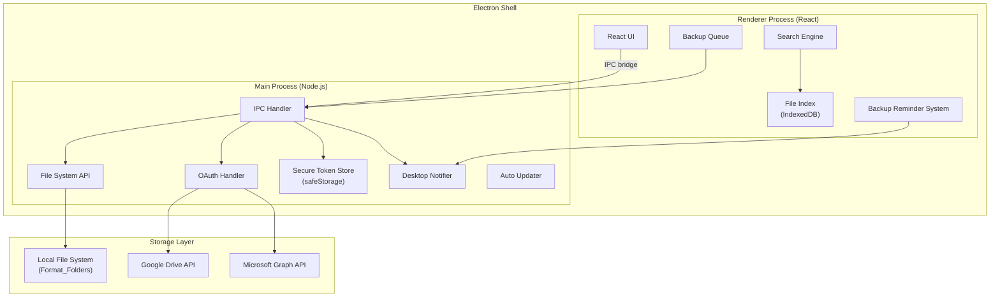
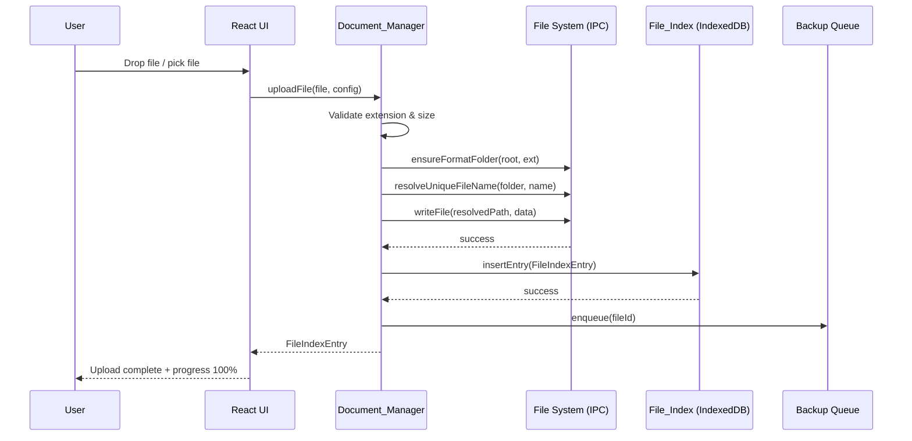
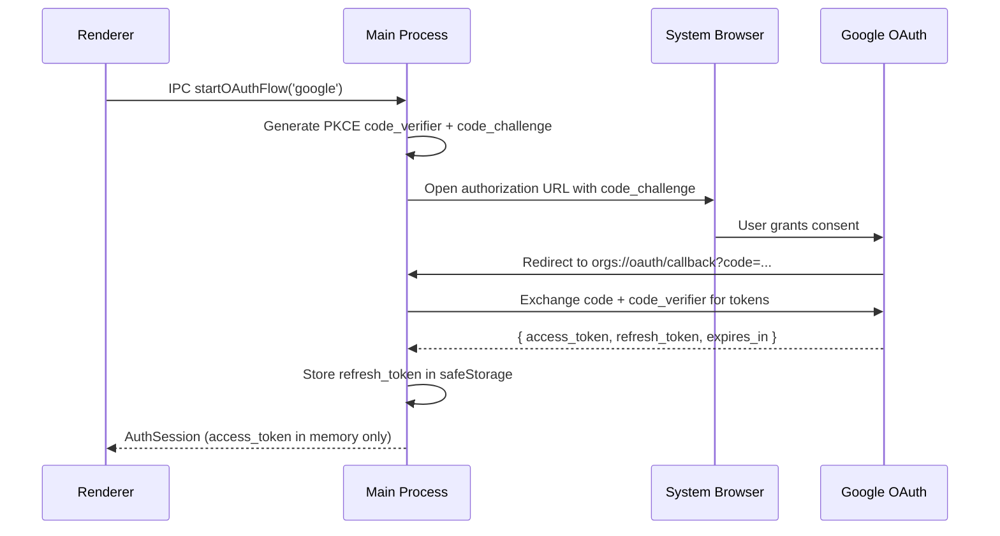
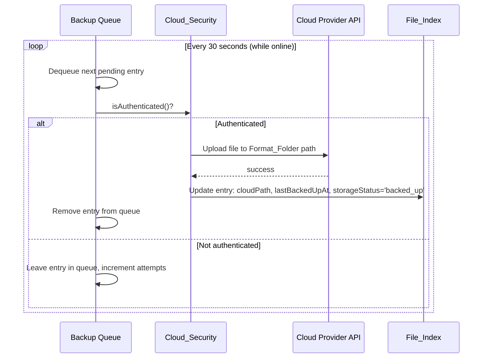
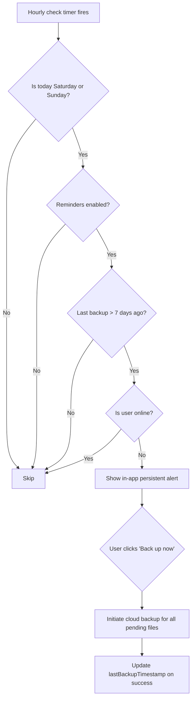
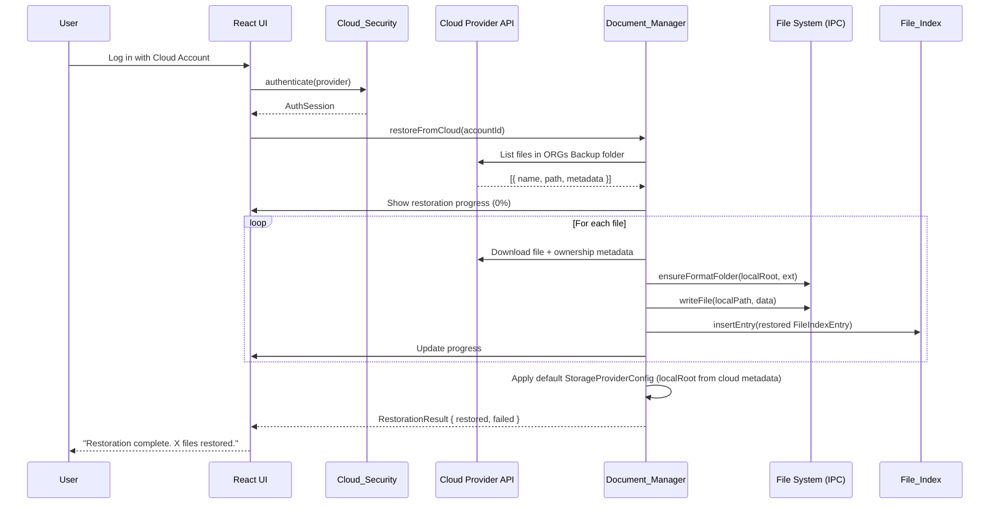

# ORGs Document Management System - Design Document

## Overview

ORGs is a desktop file organization system that provides automatic file organization, cloud backup, and unified file access. The system is built on Electron for desktop deployment and integrates with Google Drive and Microsoft OneDrive for cloud backup capabilities.

### Key Design Principles

1. **Local-First Architecture**: Files are stored locally by default with cloud backup as optional protection
2. **Automatic Organization**: Files are automatically sorted into format-based folders without user intervention
3. **Unified Access**: Global search and calendar view provide quick access to any file
4. **Cloud-Agnostic**: Support for multiple cloud providers (Google Drive, Microsoft OneDrive)
5. **Cross-Device Continuity**: File ownership metadata enables seamless access across devices
6. **Security-First**: Cloud account authentication serves as the primary security mechanism

## Architecture

### System Components

The ORGs system consists of several interconnected components:

- **Document_Manager**: Handles file uploads, organization, and storage routing
- **Search_Engine**: Provides global file search with indexing
- **Calendar_View**: Displays upload history chronologically
- **File_Viewer**: Opens files from local or cloud storage
- **Cloud_Security**: Manages OAuth authentication and token lifecycle
- **Backup_Reminder_System**: Tracks backup status and sends reminders
- **File_Index**: Maintains metadata registry for all files
- **Electron_Shell**: Packages the application as a desktop app

### Data Flow

1. **File Upload**: User uploads → Document_Manager validates → File stored in Format_Folder → File_Index updated → Cloud backup queued
2. **File Search**: User query → Search_Engine queries File_Index → Results filtered → File_Viewer opens selected file
3. **Cloud Backup**: Files queued → Cloud_Security verifies auth → Files uploaded → File_Index updated with cloud path
4. **Cross-Device Restoration**: User logs in → Cloud_Security verifies → File_Index retrieved → Files restored with Format_Folder structure


### High-Level Architecture Diagram




## Components and Interfaces

### Electron Main/Renderer Process Architecture

Electron enforces a strict process boundary. All privileged operations (file system access, OAuth, secure storage, native notifications) run in the **Main Process** and are exposed to the **Renderer Process** exclusively via a typed IPC bridge defined in a `preload.ts` script.

```
src/
  electron/
    main.ts              # Main process entry point
    preload.ts           # Context bridge (exposes window.electronAPI)
    ipc/
      fileSystem.ts      # IPC handlers for FS operations
      oauth.ts           # IPC handlers for OAuth flows
      notifications.ts   # IPC handlers for desktop notifications
      updater.ts         # IPC handlers for auto-update
  src/                   # Existing React app (renderer process)
    lib/
      electron/
        electronBridge.ts  # Type-safe wrapper around window.electronAPI
    ...
```

**IPC API surface** (`window.electronAPI`):

```typescript
interface ElectronAPI {
  // File system
  selectDirectory(): Promise<string | null>;
  readFile(path: string): Promise<Buffer>;
  writeFile(path: string, data: Buffer): Promise<void>;
  deleteFile(path: string): Promise<void>;
  renameFile(oldPath: string, newPath: string): Promise<void>;
  ensureDir(path: string): Promise<void>;
  openWithDefault(path: string): Promise<void>;

  // OAuth
  startOAuthFlow(provider: 'google' | 'microsoft'): Promise<OAuthTokens>;
  refreshToken(provider: 'google' | 'microsoft', refreshToken: string): Promise<OAuthTokens>;

  // Secure storage
  storeSecret(key: string, value: string): Promise<void>;
  retrieveSecret(key: string): Promise<string | null>;
  deleteSecret(key: string): Promise<void>;

  // Notifications
  showNotification(title: string, body: string): Promise<void>;

  // Window state
  getWindowBounds(): Promise<{ x: number; y: number; width: number; height: number }>;
}
```

### Document_Manager Component

The Document_Manager orchestrates the full file lifecycle: upload, organization, rename, move, delete, and cloud backup dispatch.

**Interface:**

```typescript
interface DocumentManager {
  uploadFile(file: File, config: StorageProviderConfig): Promise<FileIndexEntry>;
  deleteFile(fileId: string): Promise<void>;
  renameFile(fileId: string, newName: string): Promise<FileIndexEntry>;
  moveFile(fileId: string, targetFolder: string): Promise<FileIndexEntry>;
  queueCloudBackup(fileId: string): Promise<void>;
  restoreFromCloud(accountId: string): Promise<RestorationResult>;
}
```

### Search_Engine Component

Wraps the existing `SearchIndexService` with ORGs-specific file metadata indexing. Queries run entirely in-memory against the File_Index for sub-500ms response times.

**Interface:**

```typescript
interface SearchEngine {
  indexFile(entry: FileIndexEntry): void;
  removeFromIndex(fileId: string): void;
  query(q: SearchQuery): SearchResult[];
  rebuildIndex(entries: FileIndexEntry[]): void;
}
```

### Cloud_Security Component

Manages the OAuth 2.0 token lifecycle for Google Drive and Microsoft OneDrive. Tokens are stored in Electron's `safeStorage` (OS keychain on macOS/Windows, libsecret on Linux).

**Interface:**

```typescript
interface CloudSecurity {
  authenticate(provider: CloudProvider): Promise<AuthSession>;
  verifySession(session: AuthSession): Promise<boolean>;
  refreshIfExpiring(session: AuthSession): Promise<AuthSession>;
  revokeSession(session: AuthSession): Promise<void>;
  isAuthenticated(): boolean;
}
```

### Backup_Reminder_System Component

Runs a periodic check (every hour while the app is open) to determine whether a weekend reminder should be shown.

**Interface:**

```typescript
interface BackupReminderSystem {
  checkAndNotify(): Promise<void>;
  getLastBackupTimestamp(): Date | null;
  updateLastBackupTimestamp(): void;
  isRemindersEnabled(): boolean;
  setRemindersEnabled(enabled: boolean): void;
}
```


## Data Models

### File_Index Entry

The File_Index is the central registry for all files. It is persisted in **IndexedDB** (via the renderer process) so it survives app restarts and supports efficient querying without size limits of localStorage.

```typescript
interface FileIndexEntry {
  // Identity
  id: string;                        // UUID v4, stable across renames/moves
  name: string;                      // Current file name (without path)
  originalName: string;              // Name at upload time (before any renames)
  extension: string;                 // Uppercase extension, e.g. "PDF", "DOCX"
  mimeType: string;                  // MIME type, e.g. "application/pdf"
  sizeBytes: number;

  // Storage
  localPath: string | null;          // Absolute path on local FS, null if local not configured
  cloudPath: string | null;          // Provider-relative path, null if not backed up
  formatFolder: string;              // e.g. "PDF", "DOCX" — the Format_Folder name
  storageStatus: 'local_only' | 'backed_up' | 'cloud_only' | 'missing' | 'restoration_failed';

  // Timestamps
  uploadedAt: string;                // ISO 8601
  lastModifiedAt: string;            // ISO 8601
  lastBackedUpAt: string | null;     // ISO 8601, null if never backed up

  // Ownership
  ownership: FileOwnershipMetadata;

  // Search tokens (denormalized for fast in-memory search)
  searchTokens: string[];
}
```

### File_Ownership_Metadata

```typescript
interface FileOwnershipMetadata {
  cloudAccountId: string;    // Provider-scoped user ID (e.g. Google sub, Microsoft oid)
  cloudProvider: 'google' | 'microsoft';
  deviceId: string;          // Stable device identifier (generated once, stored in safeStorage)
  uploadedAt: string;        // ISO 8601 — redundant with FileIndexEntry but preserved in cloud metadata
  ownerDisplayName: string;  // Display name at time of upload
}
```

### Storage_Provider Config

```typescript
interface StorageProviderConfig {
  local: LocalStorageConfig | null;
  cloud: CloudStorageConfig | null;
}

interface LocalStorageConfig {
  rootPath: string;          // Absolute path to the user-selected root directory
  configuredAt: string;      // ISO 8601
}

interface CloudStorageConfig {
  provider: 'google' | 'microsoft';
  accountId: string;         // Provider user ID
  accountEmail: string;
  rootFolderName: string;    // Folder name inside the cloud account, default "ORGs Backup"
  configuredAt: string;      // ISO 8601
}
```

### Auth Session

```typescript
interface AuthSession {
  provider: 'google' | 'microsoft';
  accountId: string;
  accountEmail: string;
  accessToken: string;       // Short-lived, stored in memory only
  refreshToken: string;      // Long-lived, stored in safeStorage
  expiresAt: number;         // Unix timestamp (ms)
  scopes: string[];
}
```

### Backup Queue Entry

```typescript
interface BackupQueueEntry {
  fileId: string;
  enqueuedAt: string;        // ISO 8601
  attempts: number;
  lastAttemptAt: string | null;
  lastError: string | null;
  status: 'pending' | 'in_progress' | 'failed';
}
```

### Calendar View Data Model

The Calendar_View derives its data entirely from the File_Index. No separate calendar data store is needed.

```typescript
// Computed from File_Index at render time
interface CalendarDayData {
  date: string;              // "YYYY-MM-DD"
  hasFiles: boolean;
  fileCount: number;
}

interface CalendarDateDetail {
  date: string;              // "YYYY-MM-DD"
  files: CalendarFileEntry[];
}

interface CalendarFileEntry {
  fileId: string;
  name: string;
  extension: string;
  uploadedAt: string;        // ISO 8601 — used for time display and sort order
  storageStatus: FileIndexEntry['storageStatus'];
}
```

The `InteractiveCalendar` component queries the File_Index grouped by `uploadedAt` date. Dates with entries are highlighted; selecting a date filters entries for that day sorted ascending by `uploadedAt`.


## Local File System Integration

### Folder Structure

When a user selects a root directory (e.g. `C:\Users\Alice\Documents\ORGs`), the Document_Manager creates Format_Folders on demand:

```
<root>/
  PDF/
    report-q1.pdf
    report-q2.pdf
  DOCX/
    meeting-notes.docx
    meeting-notes (1).docx   ← duplicate suffix
  XLSX/
  MP4/
  PNG/
  ...
```

### Format_Folder Resolution

```typescript
function resolveFormatFolder(rootPath: string, extension: string): string {
  return path.join(rootPath, extension.toUpperCase());
}

async function ensureFormatFolder(rootPath: string, extension: string): Promise<string> {
  const folderPath = resolveFormatFolder(rootPath, extension);
  await electronAPI.ensureDir(folderPath);  // mkdir -p equivalent
  return folderPath;
}
```

### Duplicate Name Handling

Before writing a file, the Document_Manager checks for name collisions within the target Format_Folder:

```typescript
async function resolveUniqueFileName(folderPath: string, fileName: string): Promise<string> {
  const { name, ext } = path.parse(fileName);
  let candidate = fileName;
  let counter = 1;
  while (await fileExists(path.join(folderPath, candidate))) {
    candidate = `${name} (${counter})${ext}`;
    counter++;
  }
  return candidate;
}
```

### File Upload Pipeline




## Cloud OAuth Flow

### Google Drive OAuth 2.0

The Electron main process handles the OAuth redirect by intercepting a custom URI scheme (`orgs://oauth/callback`) registered at app install time.



**Required Google OAuth scopes:**
- `https://www.googleapis.com/auth/drive.file` — create/read files created by the app
- `https://www.googleapis.com/auth/userinfo.email` — identify the user

### Microsoft OneDrive OAuth 2.0 (MSAL)

Uses the Microsoft Authentication Library (MSAL) pattern with the Microsoft Graph API.

**Required Microsoft Graph scopes:**
- `Files.ReadWrite.AppFolder` — read/write files in the app's dedicated folder
- `User.Read` — identify the user

**Token refresh strategy:** Both providers issue short-lived access tokens (1 hour). The `Cloud_Security` component checks `expiresAt` before every API call and proactively refreshes if the token expires within 5 minutes, using the refresh token stored in `safeStorage`.

### Token Security

- Access tokens: held in renderer process memory only, never written to disk
- Refresh tokens: encrypted via `electron.safeStorage.encryptString()` and stored in a local file at `<userData>/tokens/<provider>.enc`
- On logout: access token cleared from memory, refresh token file deleted, `safeStorage` entry removed


## Search Indexing and Query Design

### Index Structure

The Search_Engine extends the existing `SearchIndexService` with ORGs-specific file metadata. The index is rebuilt from the File_Index on app startup and updated incrementally on every upload, rename, move, or delete.

```typescript
interface FileSearchEntry extends IndexedContent {
  fileId: string;
  extension: string;          // Uppercase, e.g. "PDF"
  uploadedAt: Date;
  localPath: string | null;
  cloudPath: string | null;
  ownerAccountId: string;
}
```

### Tokenization Strategy

File names are tokenized by splitting on non-alphanumeric characters plus camelCase boundaries:

```
"Q1-Report_Final(v2).pdf"  →  ["q1", "report", "final", "v2", "pdf"]
```

N-grams (2–3 chars) are generated from each token to support partial matching. The extension is indexed as a standalone token to support format-type filtering.

### Query Execution

```typescript
function query(q: SearchQuery): FileSearchEntry[] {
  // 1. Token lookup via inverted index (fast path)
  const candidateIds = lookupTokens(q.text);

  // 2. Apply filters (extension, date range, owner)
  const filtered = candidateIds
    .map(id => index.get(id))
    .filter(entry => matchesFilters(entry, q.filters));

  // 3. Score by relevance (title prefix > token match > n-gram match)
  const scored = filtered.map(entry => ({
    entry,
    score: scoreEntry(entry, q.text),
  }));

  // 4. Sort and paginate
  return scored
    .sort((a, b) => b.score - a.score)
    .slice(q.options.offset ?? 0, (q.options.offset ?? 0) + (q.options.limit ?? 50))
    .map(s => s.entry);
}
```

**Performance target:** For an index of 10,000 files, the full query pipeline (tokenize → lookup → filter → score → sort) must complete within 500ms. Given in-memory Map lookups and a small result set, this is achievable without a dedicated search library.


## Cloud Backup System

### Backup Queue

The Backup Queue is a persistent list of files awaiting cloud backup, stored in IndexedDB. It survives app restarts so files queued before a crash are retried on next launch.



**Retry policy:** Exponential backoff starting at 30s, capped at 1 hour. After 5 failed attempts, the entry is marked `status: 'failed'` and the user is notified.

### Weekend Backup Reminder System



The reminder alert persists in the UI until explicitly dismissed. The `lastBackupTimestamp` is stored in `localStorage` (renderer-accessible) and updated after each successful full backup.


## Cross-Device File Restoration Flow

When a user installs ORGs on a new device and authenticates with their cloud account, the system automatically restores their files.



**Ownership filtering:** Each file in the cloud backup folder carries `FileOwnershipMetadata` as a custom property (Google Drive custom file properties / OneDrive open extensions). During restoration, only files where `ownership.cloudAccountId` matches the authenticated user's ID are restored.

**Default config restoration:** The user's `StorageProviderConfig` (specifically the `localPath`) is stored as a JSON file (`orgs-config.json`) in the cloud backup root folder alongside the files. On restoration, this config is read first and applied before any files are written.


## Security and Token Management

### Authentication Gate

All routes in the React app are wrapped in an `AuthGuard` component that checks `Cloud_Security.isAuthenticated()`. If the session is invalid or expired and cannot be silently refreshed, the user is redirected to the login screen and all file operations are blocked.

```typescript
// AuthGuard behavior
if (!isAuthenticated) {
  revokeAllFileAccess();   // Clear any in-memory file handles
  navigate('/login');
}
```

### Token Lifecycle

| Token Type | Storage | Lifetime | Refresh Trigger |
|---|---|---|---|
| Access Token | Renderer memory only | ~1 hour | 5 min before expiry |
| Refresh Token | `safeStorage` encrypted file | Long-lived | On access token expiry |
| Device ID | `safeStorage` | Permanent | Never (generated once) |

### Secure Storage Implementation

```typescript
// Main process — token persistence
async function storeRefreshToken(provider: string, token: string): Promise<void> {
  const encrypted = safeStorage.encryptString(token);
  await fs.writeFile(tokenPath(provider), encrypted);
}

async function retrieveRefreshToken(provider: string): Promise<string | null> {
  try {
    const encrypted = await fs.readFile(tokenPath(provider));
    return safeStorage.decryptString(encrypted);
  } catch {
    return null;
  }
}
```

### File Access Revocation

On logout or session expiry without successful refresh:
1. Access token cleared from renderer memory
2. `AuthSession` state set to `null`
3. `AuthGuard` redirects to login
4. All IPC file read/write calls return `UNAUTHORIZED` error until re-authentication

Files already open in the OS default application are not forcibly closed (OS-level), but no new file operations are permitted through the app.


## Productivity Tools Integration

The existing productivity tools (Word_Editor, Sheet_Editor, Design_Editor, Video_Player, Events Calendar, Messaging) are preserved without modification to their internal logic. Integration with the new Document_Manager is additive only.

### Save-to-Storage Integration

Each tool's "Save" action is extended to call `Document_Manager.uploadFile()` so saved files are registered in the File_Index and eligible for cloud backup:

```typescript
// Example: WordEditor save integration
async function handleSave(content: TipTapJSON, fileName: string) {
  const blob = new Blob([JSON.stringify(content)], { type: 'application/json' });
  const file = new File([blob], `${fileName}.orgs-doc`, { type: 'application/json' });
  await documentManager.uploadFile(file, storageConfig);
}
```

### Tool-to-File-Index Mapping

| Tool | File Extension | Format_Folder |
|---|---|---|
| Word_Editor | `.orgs-doc` (TipTap JSON) | `ORGS-DOC/` |
| Sheet_Editor | `.orgs-sheet` (cell JSON) | `ORGS-SHEET/` |
| Design_Editor | `.orgs-design` (canvas JSON) | `ORGS-DESIGN/` |
| Video_Player | `.mp4`, `.mov`, `.avi` | `MP4/`, `MOV/`, `AVI/` |
| Events Calendar | Internal (no file export) | N/A |
| Messaging | Internal (no file export) | N/A |

### File_Viewer Integration

When a file with an ORGs-native extension (`.orgs-doc`, `.orgs-sheet`, `.orgs-design`) is opened from the file list or search results, the File_Viewer routes to the corresponding editor component rather than opening with the OS default application:

```typescript
function openFile(entry: FileIndexEntry) {
  const nativeExtensions = {
    'orgs-doc': '/word-editor',
    'orgs-sheet': '/sheet-editor',
    'orgs-design': '/design-editor',
  };
  const route = nativeExtensions[entry.extension.toLowerCase()];
  if (route) {
    navigate(route, { state: { fileId: entry.id } });
  } else {
    electronAPI.openWithDefault(entry.localPath!);
  }
}
```


## Correctness Properties

*A property is a characteristic or behavior that should hold true across all valid executions of a system — essentially, a formal statement about what the system should do. Properties serve as the bridge between human-readable specifications and machine-verifiable correctness guarantees.*

### Property 1: Storage Config Round Trip

*For any* valid `StorageProviderConfig` (local path, cloud provider, or both), saving the config and then reloading it from persistent storage should produce an equivalent config object.

**Validates: Requirements 2.6**

---

### Property 2: Failed Backup Enqueues File

*For any* file upload where the cloud backup operation fails (network error, auth error, or provider error), the file should appear in the Backup Queue with `status: 'pending'` and the original file should remain intact in local storage.

**Validates: Requirements 2.7**

---

### Property 3: Supported Format Upload Succeeds

*For any* file whose extension is in the supported formats list (PDF, DOCX, XLSX, PPTX, TXT, CSV, PNG, JPG, JPEG, GIF, SVG, MP4, MOV, AVI, ZIP), uploading it should succeed and produce a File_Index entry with a non-null `localPath`.

**Validates: Requirements 3.3**

---

### Property 4: Upload Metadata Completeness

*For any* uploaded file, the resulting `FileIndexEntry` should contain all required fields: `name`, `extension`, `sizeBytes`, `uploadedAt`, `localPath`, and a complete `FileOwnershipMetadata` with `cloudAccountId`, `deviceId`, and `uploadedAt`.

**Validates: Requirements 3.4, 10.1, 10.2**

---

### Property 5: Duplicate File Names Get Unique Suffixes

*For any* two files with the same name uploaded to the same Format_Folder, their resolved file names in storage should be distinct (the second gets a numeric suffix).

**Validates: Requirements 3.5**

---

### Property 6: Format_Folder Placement

*For any* uploaded file, its `localPath` should contain a parent directory whose name equals the file's extension in uppercase.

**Validates: Requirements 4.1, 4.2, 4.3**

---

### Property 7: Format_Folder Idempotence

*For any* Format_Folder, uploading additional files into it should not alter the folder's name or its position within the storage root. The folder structure is append-only.

**Validates: Requirements 4.4**

---

### Property 8: Search Returns Results Within 500ms

*For any* search query against a File_Index containing up to 10,000 entries, the query should return results in under 500 milliseconds.

**Validates: Requirements 5.2**

---

### Property 9: Search Correctness — Name, Format, and Date Matching

*For any* file in the File_Index, a search query using a case-insensitive substring of its name, its exact extension, or its upload date should include that file in the results. Conversely, a query that matches none of a file's indexed fields should not return that file.

**Validates: Requirements 5.3, 5.4**

---

### Property 10: Search Result Fields Completeness

*For any* search result entry rendered in the UI, the rendered output should include the file name, format/type, upload date, and storage location.

**Validates: Requirements 5.5**

---

### Property 11: Calendar Highlight Correctness

*For any* set of files in the File_Index, a date should be highlighted in the Calendar_View if and only if at least one file has an `uploadedAt` timestamp on that date. Dates with no files should not be highlighted.

**Validates: Requirements 7.1, 7.6**

---

### Property 12: Calendar Date Detail Ordering

*For any* date with multiple uploaded files, the list returned by the Calendar_View for that date should be sorted ascending by `uploadedAt` timestamp, and should contain exactly the files whose `uploadedAt` date matches the selected date.

**Validates: Requirements 7.2, 7.4**

---

### Property 13: Backup Staleness Detection

*For any* `lastBackupTimestamp`, the Backup_Reminder_System should report `needsBackup = true` if and only if the timestamp is more than 7 days before the current time (or is null).

**Validates: Requirements 9.1**

---

### Property 14: Weekend-Only Reminder Firing

*For any* combination of (lastBackupTimestamp, currentDateTime, remindersEnabled, isOnline), the Backup_Reminder_System should fire a notification if and only if: remindersEnabled is true AND isOnline is false AND needsBackup is true AND the day of week is Saturday or Sunday.

**Validates: Requirements 9.2**

---

### Property 15: Last Backup Timestamp Updated on Success

*For any* successful backup operation, the `lastBackupTimestamp` stored by the Backup_Reminder_System should be updated to a value greater than or equal to the timestamp immediately before the backup started.

**Validates: Requirements 9.5**

---

### Property 16: Cross-Device File Retrieval by Owner

*For any* cloud account with N files backed up, logging in with that account on any device should result in exactly those N files being available for restoration (filtered by `ownership.cloudAccountId`).

**Validates: Requirements 10.3, 12.1**

---

### Property 17: Ownership Metadata Preserved Through Backup Round Trip

*For any* file with `FileOwnershipMetadata`, backing it up to cloud and then restoring it should produce a `FileIndexEntry` with identical `ownership` fields.

**Validates: Requirements 10.5, 12.3**

---

### Property 18: Unauthenticated State Blocks File Access

*For any* file operation (read, download, open) attempted while `isAuthenticated()` returns false, the operation should be rejected with an authorization error and no file data should be returned.

**Validates: Requirements 11.1, 11.3, 11.4**

---

### Property 19: Token Refresh Before Expiry

*For any* `AuthSession` where `expiresAt` is within 5 minutes of the current time, calling `refreshIfExpiring()` should return a new session with `expiresAt` greater than the original.

**Validates: Requirements 11.6**

---

### Property 20: Restoration Recreates Format_Folder Structure

*For any* set of files backed up to cloud storage, restoring them should produce a local directory structure where each file's parent folder name equals its extension in uppercase — identical to the structure that would have been created by a fresh upload.

**Validates: Requirements 12.2, 12.4**

---

### Property 21: File_Index Updated Atomically on Upload

*For any* file upload, either both the file exists on the Storage_Provider AND the File_Index contains its entry, or neither is true. There should be no state where the file exists in storage without a corresponding index entry.

**Validates: Requirements 13.1**

---

### Property 22: File_Index Entry Removed on Delete

*For any* file that is deleted, the File_Index should contain no entry with that file's `id` after the delete operation completes.

**Validates: Requirements 13.2, 15.4**

---

### Property 23: File_Index Persists Across Restarts

*For any* set of File_Index entries present before an application restart, all entries should be present and unchanged after the restart.

**Validates: Requirements 13.3**

---

### Property 24: Missing File Marked in Index

*For any* `FileIndexEntry` whose `localPath` points to a file that no longer exists on the file system, the entry's `storageStatus` should be `'missing'`.

**Validates: Requirements 13.5**

---

### Property 25: Rename Propagates to Index and Storage

*For any* file rename operation, the file should exist at the new path in the Storage_Provider and the File_Index entry should reflect the new `name` and updated `localPath`. The old path should no longer contain the file.

**Validates: Requirements 15.2**

---

### Property 26: Move Updates Index Path

*For any* file move operation to a different Format_Folder, the File_Index entry's `localPath` should reflect the new location, and the file should exist at that new path.

**Validates: Requirements 15.6**


## Error Handling

### Upload Errors

| Error Condition | Behavior |
|---|---|
| Unsupported file extension | Reject with descriptive message; no File_Index entry created |
| Local disk full | Reject with "Storage full" message; no partial write |
| Cloud backup failure | File saved locally; entry added to Backup Queue; user notified |
| Duplicate file name | Auto-resolve with numeric suffix; no user prompt |
| File read permission denied | Reject with "Cannot read file" message |

### Authentication Errors

| Error Condition | Behavior |
|---|---|
| OAuth flow cancelled by user | Return to settings; no session created |
| Token refresh fails (network) | Retry up to 3 times with exponential backoff |
| Token refresh fails (revoked) | Force logout; redirect to login; clear all tokens |
| Session expired mid-operation | Cancel operation; show "Session expired" toast; redirect to login |

### File Index Errors

| Error Condition | Behavior |
|---|---|
| IndexedDB write fails | Rollback file write; show error; no partial state |
| File missing at stored path | Mark entry `storageStatus: 'missing'`; show indicator in UI |
| Restoration file not found in cloud | Mark entry `storageStatus: 'restoration_failed'`; continue with remaining files |

### Backup Queue Errors

| Error Condition | Behavior |
|---|---|
| Cloud API rate limit | Pause queue; retry after provider-specified delay |
| Network offline | Pause queue; resume when online detected |
| Max retries exceeded (5) | Mark entry `status: 'failed'`; notify user |


## Testing Strategy

### Dual Testing Approach

Both unit tests and property-based tests are required. They are complementary:
- **Unit tests** verify specific examples, integration points, and error conditions
- **Property-based tests** verify universal correctness across all valid inputs

### Unit Tests (Vitest + Testing Library)

Focus areas:
- `resolveUniqueFileName` — specific collision scenarios (0, 1, N duplicates)
- `resolveFormatFolder` — known extension inputs and uppercase normalization
- `Cloud_Security.refreshIfExpiring` — token near-expiry and not-near-expiry examples
- `Backup_Reminder_System.checkAndNotify` — specific day/time/online combinations
- `SearchEngine.query` — empty query, single result, no results, format filter
- `FileIndexService` — insert, delete, update, persist/reload cycle
- `AuthGuard` — renders children when authenticated, redirects when not
- Restoration error path — `storageStatus: 'restoration_failed'` set correctly
- Calendar_View — date with files highlighted, date without files not highlighted

### Property-Based Tests (fast-check)

**Library:** `fast-check` (TypeScript-native, works with Vitest)

**Configuration:** Each property test runs a minimum of **100 iterations**.

**Tag format:** Each test is tagged with a comment:
`// Feature: orgs-document-management-system, Property N: <property_text>`

Property test implementations map directly to the Correctness Properties section:

| Property | Test Description | fast-check Generators |
|---|---|---|
| P1: Storage Config Round Trip | `fc.record({ localPath: fc.string(), provider: fc.constantFrom('google','microsoft') })` → serialize → deserialize → deep equal | `fc.record` |
| P2: Failed Backup Enqueues File | Arbitrary file + simulated network failure → check queue contains entry | `fc.record`, `fc.string` |
| P3: Supported Format Upload | `fc.constantFrom(...SUPPORTED_EXTENSIONS)` → upload → check success | `fc.constantFrom` |
| P4: Upload Metadata Completeness | Arbitrary file → upload → check all required fields present | `fc.record`, `fc.string` |
| P5: Duplicate Names Get Suffixes | Two files with same name → check distinct resolved names | `fc.string` |
| P6: Format_Folder Placement | Arbitrary file → upload → check path contains uppercase extension folder | `fc.string`, `fc.constantFrom` |
| P7: Format_Folder Idempotence | N files uploaded to same folder → folder name unchanged | `fc.array`, `fc.string` |
| P8: Search Within 500ms | `fc.array(fc.record(...), { minLength: 10000, maxLength: 10000 })` → query → measure time | `fc.array`, `fc.record` |
| P9: Search Correctness | Arbitrary file + substring of its name → search → file in results | `fc.record`, `fc.string` |
| P10: Search Result Fields | Arbitrary search result → render → check all fields present | `fc.record` |
| P11: Calendar Highlight Correctness | Arbitrary file set → check highlighted dates = dates with files | `fc.array`, `fc.date` |
| P12: Calendar Date Detail Ordering | Arbitrary files on same date → check ascending sort | `fc.array`, `fc.date` |
| P13: Backup Staleness Detection | `fc.date()` → check `needsBackup` iff > 7 days ago | `fc.date` |
| P14: Weekend-Only Reminder | `fc.record({ day: fc.integer({min:0,max:6}), ... })` → check fires iff Sat/Sun | `fc.record`, `fc.boolean` |
| P15: Last Backup Timestamp Updated | Arbitrary backup → check timestamp ≥ pre-backup time | `fc.date` |
| P16: Cross-Device File Retrieval | Arbitrary account + N files → restore → exactly N files returned | `fc.array`, `fc.string` |
| P17: Ownership Metadata Round Trip | Arbitrary `FileOwnershipMetadata` → backup → restore → deep equal | `fc.record` |
| P18: Unauthenticated Blocks Access | Arbitrary file op in unauthenticated state → returns auth error | `fc.constantFrom` |
| P19: Token Refresh Before Expiry | Token expiring within 5 min → refresh → new `expiresAt` > old | `fc.integer` |
| P20: Restoration Recreates Folders | Arbitrary backed-up file set → restore → folder structure matches | `fc.array`, `fc.record` |
| P21: Atomic Upload | Arbitrary file → upload → both file and index entry exist or neither | `fc.record` |
| P22: Delete Removes Index Entry | Arbitrary file → upload → delete → not in index | `fc.record` |
| P23: Index Persists Across Restarts | Arbitrary index state → serialize → deserialize → deep equal | `fc.array`, `fc.record` |
| P24: Missing File Marked | Arbitrary entry with non-existent path → check `storageStatus: 'missing'` | `fc.record` |
| P25: Rename Propagates | Arbitrary file + new name → rename → new path exists, old does not | `fc.string` |
| P26: Move Updates Index Path | Arbitrary file + target folder → move → index path matches new location | `fc.string` |

### Integration Tests

- Full upload → search → open flow (local storage)
- Full upload → backup → restore flow (mocked cloud API)
- OAuth token refresh cycle (mocked provider)
- Weekend reminder end-to-end (mocked clock + offline state)
- Electron IPC bridge (using `electron-mock-ipc` or similar)
