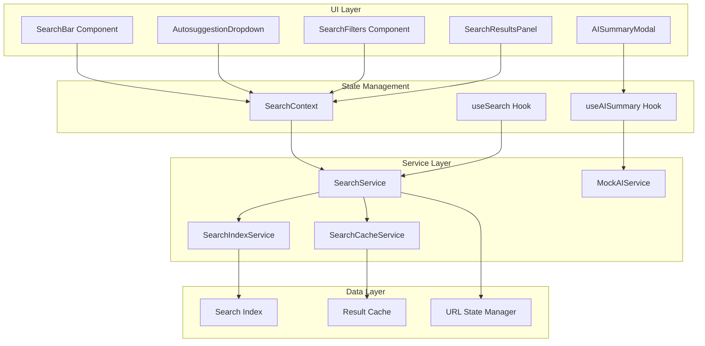

# Design Document: Search & AI Summarizer

## Overview

The Search & AI Summarizer feature provides a comprehensive global search system integrated into the application header, enabling users to quickly find and summarize content across documents, reports, messages, and files. The system consists of a search bar with real-time autosuggestions, advanced filtering capabilities, organized result displays, and an AI-powered summarization service.

### Key Design Goals

- **Performance**: Sub-200ms autosuggestion response, sub-500ms search execution
- **User Experience**: Intuitive search interface with minimal cognitive load
- **Scalability**: Efficient indexing and search for datasets up to 10,000 items
- **Shareability**: URL-based search state serialization for bookmarking and sharing
- **Responsiveness**: Debounced input, cached results, and optimistic UI updates

### Technology Stack

- **Frontend**: React 18 + TypeScript + Vite
- **UI Components**: shadcn/ui (Radix UI primitives)
- **State Management**: React Context API + custom hooks
- **Routing**: React Router v6 with URL state synchronization
- **Search Algorithm**: Client-side fuzzy matching with relevance scoring
- **Caching**: In-memory LRU cache with 5-minute TTL
- **Mock AI Service**: Simulated 2-second delay with template-based summaries

## Architecture

### High-Level Architecture



### Component Hierarchy

```
AppHeader
├── SearchBar
│   └── AutosuggestionDropdown
│       └── SuggestionItem[]
│
SearchPage (or Results Overlay)
├── SearchFilters
│   ├── NameFilter
│   ├── FileIDFilter
│   ├── FormatFilter
│   ├── DepartmentFilter
│   └── DateRangeFilter
├── SearchResultsPanel
│   ├── ResultsGroup (Documents)
│   │   └── ResultCard[]
│   ├── ResultsGroup (Reports)
│   │   └── ResultCard[]
│   └── ResultsGroup (Messages)
│       └── ResultCard[]
│
AISummaryModal (Portal)
├── ModalHeader
├── SummaryContent
│   ├── LoadingState
│   └── SummaryText
└── ModalActions
```

### Data Flow

1. **Search Input Flow**:
   - User types in SearchBar → debounced (150ms)
   - SearchContext updates query state
   - SearchService generates autosuggestions from index
   - AutosuggestionDropdown renders results

2. **Search Execution Flow**:
   - User submits search (Enter or suggestion click)
   - SearchService checks cache for existing results
   - If cache miss: SearchService queries SearchIndexService
   - Results ranked by relevance score
   - URL updated with serialized search state
   - SearchResultsPanel renders grouped results

3. **Filter Application Flow**:
   - User applies filter in SearchFilters
   - SearchContext updates filter state
   - SearchService re-executes search with filters
   - URL updated with new filter parameters
   - Results update within 300ms

4. **AI Summary Flow**:
   - User clicks AI Summary button on content item
   - AISummaryModal opens with loading state
   - MockAIService simulates 2-second processing
   - Summary generated from content templates
   - Modal displays formatted summary with actions

## Components and Interfaces

### SearchBar Component

**Location**: `src/components/search/SearchBar.tsx`

**Purpose**: Global search input in application header with autosuggestion support

**Props**:
```typescript
interface SearchBarProps {
  className?: string;
  placeholder?: string;
  onSearch?: (query: string) => void;
}
```

**State**:
- `inputValue`: Current search input text
- `isFocused`: Whether input has focus
- `showSuggestions`: Whether to display autosuggestion dropdown

**Behavior**:
- Debounces input changes by 150ms
- Shows autosuggestions after 2+ characters
- Handles keyboard navigation (Arrow keys, Enter, Escape)
- Integrates with SearchContext for state management

**Integration**:
- Embedded in AppHeader between page title and user actions
- Uses shadcn/ui Input component with custom styling
- Connects to useSearch hook for query management

### AutosuggestionDropdown Component

**Location**: `src/components/search/AutosuggestionDropdown.tsx`

**Purpose**: Display search suggestions as user types

**Props**:
```typescript
interface AutosuggestionDropdownProps {
  query: string;
  suggestions: SearchSuggestion[];
  onSelect: (suggestion: SearchSuggestion) => void;
  onClose: () => void;
  isOpen: boolean;
}

interface SearchSuggestion {
  id: string;
  type: 'content' | 'recent' | 'filter';
  title: string;
  subtitle?: string;
  icon?: React.ReactNode;
  matchedText?: string;
}
```

**Features**:
- Highlights matching text portions
- Groups suggestions by type (Recent, Documents, Reports, etc.)
- Keyboard navigation support
- Click-outside detection for closing
- Maximum 10 suggestions displayed

**Rendering**:
- Uses shadcn/ui Popover or custom positioned dropdown
- Renders below SearchBar with proper z-index
- Responsive width matching SearchBar

### SearchFilters Component

**Location**: `src/components/search/SearchFilters.tsx`

**Purpose**: Advanced filtering interface for narrowing search results

**Props**:
```typescript
interface SearchFiltersProps {
  filters: SearchFilters;
  onFiltersChange: (filters: SearchFilters) => void;
  availableFormats: string[];
  availableDepartments: Department[];
}

interface SearchFilters {
  name?: string;
  fileId?: string;
  formats?: string[];
  departmentIds?: string[];
  dateRange?: {
    start: Date;
    end: Date;
  };
}
```

**Layout**:
- Collapsible filter panel (desktop: sidebar, mobile: drawer)
- Individual filter sections with clear labels
- Active filter badges with remove action
- "Clear All Filters" button
- Filter count indicator

**Filter Types**:
1. **Name Filter**: Text input with fuzzy matching
2. **File ID Filter**: Exact match text input
3. **Format Filter**: Multi-select checkboxes (PDF, DOCX, XLSX, etc.)
4. **Department Filter**: Multi-select dropdown with department hierarchy
5. **Date Range Filter**: Date picker with presets (Today, Last 7 days, Last 30 days, Custom)

### SearchResultsPanel Component

**Location**: `src/components/search/SearchResultsPanel.tsx`

**Purpose**: Display search results grouped by content type

**Props**:
```typescript
interface SearchResultsPanelProps {
  results: SearchResults;
  query: string;
  loading: boolean;
  onLoadMore: (category: ContentType) => void;
}

interface SearchResults {
  documents: SearchResultItem[];
  reports: SearchResultItem[];
  messages: SearchResultItem[];
  totalCounts: {
    documents: number;
    reports: number;
    messages: number;
  };
}

interface SearchResultItem {
  id: string;
  type: ContentType;
  title: string;
  snippet: string;
  metadata: {
    author?: string;
    department?: string;
    date: string;
    format?: string;
  };
  relevanceScore: number;
  matchedFields: string[];
}
```

**Features**:
- Grouped results with category headers and counts
- Highlighted search terms in titles and snippets
- Pagination with "Load More" buttons (20 items per page)
- Empty state with helpful search tips
- Loading skeletons during search
- Result cards with AI Summary button

**Result Card Layout**:
- Icon indicating content type
- Title with highlighted matches
- Snippet (150 characters) with highlighted matches
- Metadata badges (author, department, date, format)
- Action buttons (Open, AI Summary)

### AISummaryModal Component

**Location**: `src/components/search/AISummaryModal.tsx`

**Purpose**: Display AI-generated content summaries

**Props**:
```typescript
interface AISummaryModalProps {
  contentId: string;
  contentType: ContentType;
  isOpen: boolean;
  onClose: () => void;
}

interface AISummary {
  contentId: string;
  contentTitle: string;
  summary: string;
  bulletPoints: string[];
  generatedAt: Date;
  metadata: {
    wordCount: number;
    readingTime: string;
  };
}
```

**States**:
1. **Loading**: Spinner with "Generating summary..." message
2. **Success**: Formatted summary with bullet points
3. **Error**: Error message with retry button

**Features**:
- Modal overlay with backdrop blur
- Close on Escape key, backdrop click, or close button
- Copy summary to clipboard action
- Responsive design (full-screen on mobile)
- Prevents background scrolling when open
- Smooth enter/exit animations

**Layout**:
- Header: Content title and close button
- Body: Summary text with bullet points
- Footer: Copy button and metadata (word count, reading time)

## Data Models

### Search Index Structure

```typescript
interface SearchIndex {
  documents: Map<string, IndexedDocument>;
  reports: Map<string, IndexedReport>;
  messages: Map<string, IndexedMessage>;
  metadata: {
    lastUpdated: Date;
    totalItems: number;
    version: string;
  };
}

interface IndexedContent {
  id: string;
  type: ContentType;
  searchableText: string; // Concatenated searchable fields
  tokens: string[]; // Tokenized for fuzzy matching
  fields: {
    title: string;
    description?: string;
    tags: string[];
    author: string;
    department: string;
    date: Date;
    format?: string;
    fileId?: string;
  };
  metadata: Record<string, any>;
}

type IndexedDocument = IndexedContent & {
  fileSize: number;
  fileType: string;
  pageCount?: number;
};

type IndexedReport = IndexedContent & {
  period: Period;
  attachmentCount: number;
};

type IndexedMessage = IndexedContent & {
  conversationId: string;
  participants: string[];
};
```

### Search Query Model

```typescript
interface SearchQuery {
  text: string;
  filters: SearchFilters;
  options: SearchOptions;
}

interface SearchOptions {
  limit?: number;
  offset?: number;
  sortBy?: 'relevance' | 'date' | 'title';
  sortOrder?: 'asc' | 'desc';
}

interface SearchFilters {
  name?: string;
  fileId?: string;
  formats?: string[];
  departmentIds?: string[];
  dateRange?: {
    start: Date;
    end: Date;
  };
  contentTypes?: ContentType[];
}
```

### Search Result Model

```typescript
interface SearchResult {
  item: IndexedContent;
  score: number;
  matches: SearchMatch[];
  snippet: string;
}

interface SearchMatch {
  field: string;
  value: string;
  indices: [number, number][]; // Match positions for highlighting
}
```

### URL State Model

```typescript
interface SearchURLState {
  q?: string; // Query text
  name?: string;
  fileId?: string;
  formats?: string; // Comma-separated
  depts?: string; // Comma-separated department IDs
  from?: string; // ISO date string
  to?: string; // ISO date string
  sort?: string;
  page?: string;
}
```

## Search Algorithms

### Indexing Algorithm

**Purpose**: Build searchable index from content items

**Process**:
1. **Tokenization**: Split text into searchable tokens
   - Lowercase conversion
   - Remove special characters
   - Split on whitespace and punctuation
   - Generate n-grams for partial matching (2-3 character sequences)

2. **Field Extraction**: Extract searchable fields
   - Title (weight: 3x)
   - Description (weight: 2x)
   - Tags (weight: 2x)
   - Content body (weight: 1x)
   - Author, department (weight: 1x)

3. **Index Storage**: Store in efficient data structure
   - Map by ID for O(1) lookup
   - Inverted index for token → document mapping
   - Metadata for filtering

**Implementation**:
```typescript
class SearchIndexService {
  private index: SearchIndex;
  private invertedIndex: Map<string, Set<string>>; // token → content IDs
  
  buildIndex(items: ContentItem[]): void {
    for (const item of items) {
      const tokens = this.tokenize(item);
      const indexed = this.createIndexedContent(item, tokens);
      
      this.index[item.type].set(item.id, indexed);
      
      // Build inverted index
      for (const token of tokens) {
        if (!this.invertedIndex.has(token)) {
          this.invertedIndex.set(token, new Set());
        }
        this.invertedIndex.get(token)!.add(item.id);
      }
    }
  }
  
  private tokenize(item: ContentItem): string[] {
    const text = [
      item.title,
      item.description,
      ...item.tags,
      item.content
    ].join(' ').toLowerCase();
    
    return text.split(/\W+/).filter(t => t.length > 1);
  }
}
```

### Search Algorithm

**Purpose**: Find and rank relevant content based on query

**Approach**: TF-IDF inspired relevance scoring with fuzzy matching

**Steps**:
1. **Query Tokenization**: Parse and tokenize search query
2. **Candidate Retrieval**: Use inverted index to find potential matches
3. **Fuzzy Matching**: Apply Levenshtein distance for typo tolerance
4. **Relevance Scoring**: Calculate score based on:
   - Term frequency in document
   - Field weight (title > description > content)
   - Match type (exact > prefix > fuzzy)
   - Recency boost (newer content scores higher)
5. **Filter Application**: Apply user-specified filters
6. **Ranking**: Sort by relevance score descending
7. **Pagination**: Return requested page of results

**Scoring Formula**:
```
score = Σ(term_score × field_weight × match_type_multiplier) + recency_boost

where:
- term_score = frequency of term in document
- field_weight = 3 (title), 2 (description/tags), 1 (content)
- match_type_multiplier = 1.0 (exact), 0.8 (prefix), 0.5 (fuzzy)
- recency_boost = 1 / (days_old + 1) × 10
```

**Performance Optimizations**:
- Early termination for low-scoring candidates
- Limit candidate set to top 1000 before full scoring
- Cache tokenized queries
- Parallel scoring for large result sets

### Autosuggestion Algorithm

**Purpose**: Generate real-time search suggestions

**Strategy**: Prefix matching with recent search history

**Process**:
1. **Recent Searches**: Check user's recent search history (last 10)
2. **Prefix Matching**: Find content items with titles starting with query
3. **Popular Results**: Include frequently accessed items matching query
4. **Ranking**: Order by:
   - Recent searches first
   - Exact prefix matches
   - Popularity score
5. **Limit**: Return top 10 suggestions

**Implementation**:
```typescript
class AutosuggestionService {
  generateSuggestions(query: string, limit: number = 10): SearchSuggestion[] {
    const suggestions: SearchSuggestion[] = [];
    
    // Add recent searches
    const recentMatches = this.getRecentSearches()
      .filter(s => s.toLowerCase().includes(query.toLowerCase()))
      .slice(0, 3);
    
    suggestions.push(...recentMatches.map(text => ({
      type: 'recent',
      title: text,
      icon: <Clock />
    })));
    
    // Add content matches
    const contentMatches = this.searchIndex
      .findByPrefix(query)
      .slice(0, limit - suggestions.length);
    
    suggestions.push(...contentMatches.map(item => ({
      type: 'content',
      title: item.title,
      subtitle: item.department,
      icon: this.getIconForType(item.type)
    })));
    
    return suggestions.slice(0, limit);
  }
}
```

## Performance Optimizations

### Debouncing

**Implementation**: Custom `useDebouncedValue` hook

```typescript
function useDebouncedValue<T>(value: T, delay: number): T {
  const [debouncedValue, setDebouncedValue] = useState(value);
  
  useEffect(() => {
    const timer = setTimeout(() => setDebouncedValue(value), delay);
    return () => clearTimeout(timer);
  }, [value, delay]);
  
  return debouncedValue;
}
```

**Usage**:
- SearchBar input: 150ms delay
- Filter changes: 300ms delay
- Prevents excessive search executions during typing

### Caching Strategy

**Implementation**: LRU Cache with TTL

```typescript
class SearchCacheService {
  private cache: Map<string, CacheEntry>;
  private maxSize: number = 100;
  private ttl: number = 5 * 60 * 1000; // 5 minutes
  
  get(key: string): SearchResults | null {
    const entry = this.cache.get(key);
    if (!entry) return null;
    
    if (Date.now() - entry.timestamp > this.ttl) {
      this.cache.delete(key);
      return null;
    }
    
    // Move to end (LRU)
    this.cache.delete(key);
    this.cache.set(key, entry);
    
    return entry.results;
  }
  
  set(key: string, results: SearchResults): void {
    if (this.cache.size >= this.maxSize) {
      const firstKey = this.cache.keys().next().value;
      this.cache.delete(firstKey);
    }
    
    this.cache.set(key, {
      results,
      timestamp: Date.now()
    });
  }
  
  generateKey(query: SearchQuery): string {
    return JSON.stringify({
      text: query.text,
      filters: query.filters,
      options: query.options
    });
  }
}
```

**Cache Key**: Serialized query + filters + options

**Benefits**:
- Sub-50ms response for cached queries
- Reduces redundant search operations
- Improves perceived performance

### Virtual Scrolling

**Implementation**: For large result sets (>100 items)

**Library**: `react-window` or `@tanstack/react-virtual`

**Benefits**:
- Render only visible items
- Smooth scrolling with thousands of results
- Reduced memory footprint

### Index Optimization

**Strategies**:
1. **Lazy Loading**: Build index incrementally as content loads
2. **Web Worker**: Offload indexing to background thread
3. **Incremental Updates**: Update index on content changes, not full rebuild
4. **Compressed Storage**: Use efficient data structures (Tries for prefix matching)

## URL Serialization

### Purpose

Enable shareable and bookmarkable search states through URL parameters

### URL Format

```
/search?q=budget&formats=pdf,xlsx&depts=fin,hr&from=2024-01-01&to=2024-12-31&sort=date
```

### Serialization Implementation

```typescript
class SearchURLManager {
  serialize(query: SearchQuery): string {
    const params = new URLSearchParams();
    
    if (query.text) params.set('q', query.text);
    if (query.filters.name) params.set('name', query.filters.name);
    if (query.filters.fileId) params.set('fileId', query.filters.fileId);
    if (query.filters.formats?.length) {
      params.set('formats', query.filters.formats.join(','));
    }
    if (query.filters.departmentIds?.length) {
      params.set('depts', query.filters.departmentIds.join(','));
    }
    if (query.filters.dateRange) {
      params.set('from', query.filters.dateRange.start.toISOString().split('T')[0]);
      params.set('to', query.filters.dateRange.end.toISOString().split('T')[0]);
    }
    if (query.options.sortBy) {
      params.set('sort', query.options.sortBy);
    }
    
    return params.toString();
  }
  
  parse(urlParams: URLSearchParams): SearchQuery {
    return {
      text: urlParams.get('q') || '',
      filters: {
        name: urlParams.get('name') || undefined,
        fileId: urlParams.get('fileId') || undefined,
        formats: urlParams.get('formats')?.split(',').filter(Boolean),
        departmentIds: urlParams.get('depts')?.split(',').filter(Boolean),
        dateRange: this.parseDateRange(urlParams)
      },
      options: {
        sortBy: (urlParams.get('sort') as any) || 'relevance'
      }
    };
  }
  
  private parseDateRange(params: URLSearchParams) {
    const from = params.get('from');
    const to = params.get('to');
    
    if (!from || !to) return undefined;
    
    return {
      start: new Date(from),
      end: new Date(to)
    };
  }
}
```

### React Router Integration

```typescript
function SearchPage() {
  const [searchParams, setSearchParams] = useSearchParams();
  const urlManager = new SearchURLManager();
  
  const query = urlManager.parse(searchParams);
  
  const handleSearch = (newQuery: SearchQuery) => {
    const serialized = urlManager.serialize(newQuery);
    setSearchParams(serialized);
  };
  
  // ... rest of component
}
```

## Mock AI Service

### Purpose

Simulate AI-powered content summarization with realistic delays and outputs

### Implementation

**Location**: `src/lib/search/mockAIService.ts`

```typescript
class MockAIService {
  private summaryCache: Map<string, AISummary> = new Map();
  
  async generateSummary(
    contentId: string,
    contentType: ContentType,
    content: string
  ): Promise<AISummary> {
    // Check cache
    if (this.summaryCache.has(contentId)) {
      return this.summaryCache.get(contentId)!;
    }
    
    // Simulate 2-second processing delay
    await this.delay(2000);
    
    // Generate mock summary
    const summary = this.createMockSummary(contentType, content);
    
    // Cache result
    this.summaryCache.set(contentId, summary);
    
    return summary;
  }
  
  private createMockSummary(type: ContentType, content: string): AISummary {
    const wordCount = content.split(/\s+/).length;
    const readingTime = Math.ceil(wordCount / 200); // 200 words per minute
    
    // Extract key sentences (simple heuristic)
    const sentences = content.split(/[.!?]+/).filter(s => s.trim().length > 20);
    const keyPoints = sentences
      .slice(0, 5)
      .map(s => s.trim())
      .filter(Boolean);
    
    const summaryText = this.generateSummaryText(type, keyPoints);
    
    return {
      contentId: '',
      contentTitle: '',
      summary: summaryText,
      bulletPoints: keyPoints.length > 0 ? keyPoints : this.getDefaultBulletPoints(type),
      generatedAt: new Date(),
      metadata: {
        wordCount,
        readingTime: `${readingTime} min read`
      }
    };
  }
  
  private generateSummaryText(type: ContentType, keyPoints: string[]): string {
    const intro = this.getSummaryIntro(type);
    const points = keyPoints.slice(0, 3).join('. ');
    return `${intro} ${points}.`;
  }
  
  private getSummaryIntro(type: ContentType): string {
    const intros = {
      document: 'This document covers',
      report: 'This report analyzes',
      message: 'This conversation discusses'
    };
    return intros[type] || 'This content includes';
  }
  
  private getDefaultBulletPoints(type: ContentType): string[] {
    const defaults = {
      document: [
        'Key information and documentation',
        'Important details and specifications',
        'Relevant context and background'
      ],
      report: [
        'Performance metrics and analysis',
        'Key findings and insights',
        'Recommendations and next steps'
      ],
      message: [
        'Main discussion topics',
        'Action items and decisions',
        'Follow-up requirements'
      ]
    };
    return defaults[type] || ['Summary not available'];
  }
  
  private delay(ms: number): Promise<void> {
    return new Promise(resolve => setTimeout(resolve, ms));
  }
}

export const mockAIService = new MockAIService();
```

### Summary Templates

**Document Summary Template**:
```
This document covers [topic]. Key points include [point 1], [point 2], and [point 3]. 
The content provides [value proposition] for [target audience].
```

**Report Summary Template**:
```
This [period] report analyzes [subject]. Main findings show [finding 1], [finding 2], 
and [finding 3]. Recommendations include [action items].
```

**Message Summary Template**:
```
This conversation discusses [topic]. Participants covered [point 1], [point 2], 
and [point 3]. Action items: [actions].
```


## Correctness Properties

*A property is a characteristic or behavior that should hold true across all valid executions of a system—essentially, a formal statement about what the system should do. Properties serve as the bridge between human-readable specifications and machine-verifiable correctness guarantees.*

### Property Reflection

After analyzing all acceptance criteria, I identified the following redundancies:
- Properties 10.3 and 10.5 are subsumed by the round-trip property 10.4
- Properties 5.2 and 5.3 can be combined into a single comprehensive search scope property
- Properties 4.1 and 4.2 can be combined into a single property about result grouping with counts

### Property 1: Autosuggestion Count Limit

*For any* search query, the autosuggestion dropdown SHALL display at most 10 suggestions.

**Validates: Requirements 1.3**

### Property 2: Autosuggestion Minimum Length

*For any* search query with 2 or more characters, the search system SHALL generate autosuggestions.

**Validates: Requirements 2.1**

### Property 3: Autosuggestion Content Types

*For any* search query that generates suggestions, the suggestions SHALL include matching content item names, file IDs, and recent searches.

**Validates: Requirements 2.2**

### Property 4: Autosuggestion Highlighting

*For any* suggestion displayed in the autosuggestion dropdown, the portion of text matching the search query SHALL be highlighted.

**Validates: Requirements 2.3**

### Property 5: Multiple Filter Application

*For any* set of search filters applied simultaneously, all filters SHALL be applied to the search results (intersection of filter criteria).

**Validates: Requirements 3.3**

### Property 6: Filter Removal Updates Results

*For any* active search filter, removing that filter SHALL change the search results to exclude that filter's criteria.

**Validates: Requirements 3.4**

### Property 7: Active Filter Count Accuracy

*For any* set of active search filters, the displayed filter count SHALL equal the number of active filters.

**Validates: Requirements 3.5**

### Property 8: Results Grouped by Type with Counts

*For any* search results, they SHALL be grouped into Documents, Reports, and Messages categories, and the displayed count for each category SHALL equal the actual number of results in that category.

**Validates: Requirements 4.1, 4.2**

### Property 9: Initial Results Pagination

*For any* search results in a category, the initial display SHALL show at most 20 results per category.

**Validates: Requirements 4.4**

### Property 10: Load More Availability

*For any* search results category with more than 20 results, a load more action SHALL be provided.

**Validates: Requirements 4.5**

### Property 11: Query Term Highlighting in Results

*For any* search result item, the search query terms SHALL be highlighted in the result title and snippet.

**Validates: Requirements 4.6**

### Property 12: Cross-Content Search Scope

*For any* search query executed, the search SHALL be performed across all indexed content types (documents, reports, messages, images, files) and across all searchable fields (names, descriptions, tags, metadata).

**Validates: Requirements 5.2, 5.3**

### Property 13: Results Ranked by Relevance

*For any* search results returned, they SHALL be ordered by relevance score in descending order (highest relevance first).

**Validates: Requirements 5.4**

### Property 14: Cached Summary Indication

*For any* content item that has been previously summarized, the AI Summary button SHALL indicate that a summary exists (different visual state).

**Validates: Requirements 6.5**

### Property 15: Summary Display Formatting

*For any* generated AI summary, the summary modal SHALL display the summary text with proper formatting (paragraphs, bullet points).

**Validates: Requirements 7.3**

### Property 16: Summary Modal Content Display

*For any* content item being summarized, the summary modal SHALL display the content item's title and metadata.

**Validates: Requirements 7.4**

### Property 17: Modal No Navigation

*For any* summary modal opened, the modal SHALL overlay the current page without changing the browser URL or triggering navigation.

**Validates: Requirements 8.1**

### Property 18: Modal Prevents Background Scroll

*For any* summary modal in open state, background page scrolling SHALL be prevented.

**Validates: Requirements 8.5**

### Property 19: Search Result Caching

*For any* search query executed, if the same query is executed again within 5 minutes, the cached results SHALL be returned.

**Validates: Requirements 9.2**

### Property 20: URL Parameter Parsing

*For any* valid URL query parameters representing a search state, parsing them SHALL produce a valid SearchQuery and SearchFilters object.

**Validates: Requirements 10.1**

### Property 21: Search State Serialization

*For any* SearchQuery and SearchFilters object, serializing them SHALL produce valid URL query parameters.

**Validates: Requirements 10.2**

### Property 22: URL Update on Search

*For any* search executed with filters applied, the browser URL SHALL be updated to reflect the search state.

**Validates: Requirements 10.3**

### Property 23: Search State Round-Trip

*For any* valid search state (query + filters), serializing to URL parameters then parsing back SHALL produce an equivalent search state (round-trip property).

**Validates: Requirements 10.4, 10.5**

## Error Handling

### Search Errors

**Empty Query Handling**:
- Queries with only whitespace are treated as empty
- Empty queries clear results and hide autosuggestions
- No error message displayed (graceful degradation)

**Invalid Filter Values**:
- Invalid date ranges (start > end) show validation error
- Invalid department IDs are silently filtered out
- Invalid format types are ignored
- Malformed filter values default to empty

**Search Timeout**:
- Searches exceeding 5 seconds display timeout message
- User can retry search or modify query
- Partial results (if any) are displayed with warning

**Index Unavailable**:
- If search index fails to load, display error message
- Provide retry action
- Disable search functionality until index loads

### AI Summary Errors

**Content Not Found**:
- Display error message: "Content not available for summarization"
- Provide close action
- Log error for debugging

**Summary Generation Failure**:
- Display error message: "Failed to generate summary. Please try again."
- Provide retry button
- Fall back to showing content metadata only

**Network Timeout** (for future real AI service):
- Display timeout message after 10 seconds
- Provide retry action
- Cache partial results if available

### URL Parsing Errors

**Malformed URL Parameters**:
- Invalid date formats default to no date filter
- Invalid enum values (sort, format) default to standard values
- Malformed arrays (comma-separated) filter out invalid entries
- Graceful degradation: parse what's valid, ignore rest

**Missing Required Parameters**:
- Missing query parameter defaults to empty search
- Missing optional filters default to no filters applied
- System remains functional with partial state

### User Feedback

**Error Toast Notifications**:
- Non-critical errors show toast (auto-dismiss after 5 seconds)
- Critical errors show modal with explicit dismiss action
- Include actionable error messages with next steps

**Loading States**:
- Skeleton loaders for search results
- Spinner for AI summary generation
- Progress indicator for large result sets

**Empty States**:
- No results: "No results found. Try different keywords or filters."
- No suggestions: Silently hide dropdown (not an error)
- No cached summary: Normal button state (not an error)

## Testing Strategy

### Unit Testing

**Framework**: Vitest with React Testing Library

**Coverage Areas**:
1. **Component Rendering**:
   - SearchBar renders with correct placeholder
   - AutosuggestionDropdown renders suggestions correctly
   - SearchFilters renders all filter types
   - SearchResultsPanel renders grouped results
   - AISummaryModal renders in all states (loading, success, error)

2. **User Interactions**:
   - Typing in SearchBar triggers debounced updates
   - Clicking suggestion executes search or navigates
   - Pressing Enter in SearchBar executes search
   - Clicking outside dropdown closes it
   - Pressing Escape closes modal
   - Clicking filter checkboxes updates filter state
   - Clicking "Clear All Filters" removes all filters
   - Clicking "Load More" loads additional results
   - Clicking "Copy" copies summary to clipboard

3. **Edge Cases**:
   - Empty search query handling
   - No results found display
   - Search timeout handling
   - Invalid filter values
   - Malformed URL parameters
   - Content not found for summarization
   - Summary generation failure

4. **Integration Points**:
   - SearchContext provides correct state to components
   - useSearch hook integrates with SearchService
   - useAISummary hook integrates with MockAIService
   - URL state synchronization with React Router

**Example Unit Tests**:
```typescript
describe('SearchBar', () => {
  it('should display autosuggestions after typing 2 characters', async () => {
    render(<SearchBar />);
    const input = screen.getByPlaceholderText('Search...');
    
    await userEvent.type(input, 'te');
    
    await waitFor(() => {
      expect(screen.getByRole('listbox')).toBeInTheDocument();
    });
  });
  
  it('should hide autosuggestions when input is cleared', async () => {
    render(<SearchBar />);
    const input = screen.getByPlaceholderText('Search...');
    
    await userEvent.type(input, 'test');
    await userEvent.clear(input);
    
    await waitFor(() => {
      expect(screen.queryByRole('listbox')).not.toBeInTheDocument();
    });
  });
});

describe('SearchFilters', () => {
  it('should display correct count of active filters', () => {
    const filters = {
      formats: ['pdf', 'docx'],
      departmentIds: ['dept1']
    };
    
    render(<SearchFilters filters={filters} />);
    
    expect(screen.getByText('3 filters')).toBeInTheDocument();
  });
  
  it('should clear all filters when clear button clicked', async () => {
    const onFiltersChange = vi.fn();
    const filters = { formats: ['pdf'], departmentIds: ['dept1'] };
    
    render(<SearchFilters filters={filters} onFiltersChange={onFiltersChange} />);
    
    await userEvent.click(screen.getByText('Clear All'));
    
    expect(onFiltersChange).toHaveBeenCalledWith({});
  });
});
```

### Property-Based Testing

**Framework**: fast-check (JavaScript property-based testing library)

**Configuration**: Minimum 100 iterations per property test

**Test Organization**: Each correctness property maps to one property-based test

**Property Test Examples**:

```typescript
import fc from 'fast-check';

describe('Search Properties', () => {
  it('Property 1: Autosuggestion count limit', () => {
    // Feature: search-ai-summarizer, Property 1: For any search query, the autosuggestion dropdown SHALL display at most 10 suggestions
    fc.assert(
      fc.property(
        fc.string({ minLength: 2, maxLength: 50 }),
        (query) => {
          const suggestions = autosuggestionService.generateSuggestions(query);
          expect(suggestions.length).toBeLessThanOrEqual(10);
        }
      ),
      { numRuns: 100 }
    );
  });
  
  it('Property 2: Autosuggestion minimum length', () => {
    // Feature: search-ai-summarizer, Property 2: For any search query with 2 or more characters, the search system SHALL generate autosuggestions
    fc.assert(
      fc.property(
        fc.string({ minLength: 2, maxLength: 50 }),
        (query) => {
          const suggestions = autosuggestionService.generateSuggestions(query);
          expect(suggestions).toBeDefined();
          expect(Array.isArray(suggestions)).toBe(true);
        }
      ),
      { numRuns: 100 }
    );
  });
  
  it('Property 5: Multiple filter application', () => {
    // Feature: search-ai-summarizer, Property 5: For any set of search filters applied simultaneously, all filters SHALL be applied to the search results
    fc.assert(
      fc.property(
        fc.record({
          formats: fc.array(fc.constantFrom('pdf', 'docx', 'xlsx'), { maxLength: 3 }),
          departmentIds: fc.array(fc.uuid(), { maxLength: 3 })
        }),
        fc.array(mockContentItem(), { minLength: 10, maxLength: 100 }),
        (filters, contentItems) => {
          searchIndexService.buildIndex(contentItems);
          const results = searchService.search({ text: '', filters });
          
          // All results should match ALL filters
          results.forEach(result => {
            if (filters.formats.length > 0) {
              expect(filters.formats).toContain(result.item.fields.format);
            }
            if (filters.departmentIds.length > 0) {
              expect(filters.departmentIds).toContain(result.item.fields.department);
            }
          });
        }
      ),
      { numRuns: 100 }
    );
  });
  
  it('Property 7: Active filter count accuracy', () => {
    // Feature: search-ai-summarizer, Property 7: For any set of active search filters, the displayed filter count SHALL equal the number of active filters
    fc.assert(
      fc.property(
        fc.record({
          name: fc.option(fc.string(), { nil: undefined }),
          fileId: fc.option(fc.string(), { nil: undefined }),
          formats: fc.option(fc.array(fc.string()), { nil: undefined }),
          departmentIds: fc.option(fc.array(fc.string()), { nil: undefined })
        }),
        (filters) => {
          const count = countActiveFilters(filters);
          const expected = [
            filters.name,
            filters.fileId,
            filters.formats?.length,
            filters.departmentIds?.length
          ].filter(Boolean).length;
          
          expect(count).toBe(expected);
        }
      ),
      { numRuns: 100 }
    );
  });
  
  it('Property 13: Results ranked by relevance', () => {
    // Feature: search-ai-summarizer, Property 13: For any search results returned, they SHALL be ordered by relevance score in descending order
    fc.assert(
      fc.property(
        fc.string({ minLength: 2, maxLength: 20 }),
        fc.array(mockContentItem(), { minLength: 5, maxLength: 50 }),
        (query, contentItems) => {
          searchIndexService.buildIndex(contentItems);
          const results = searchService.search({ text: query, filters: {} });
          
          // Check that results are sorted by score descending
          for (let i = 0; i < results.length - 1; i++) {
            expect(results[i].score).toBeGreaterThanOrEqual(results[i + 1].score);
          }
        }
      ),
      { numRuns: 100 }
    );
  });
  
  it('Property 23: Search state round-trip', () => {
    // Feature: search-ai-summarizer, Property 23: For any valid search state, serializing to URL then parsing back SHALL produce an equivalent search state
    fc.assert(
      fc.property(
        fc.record({
          text: fc.string(),
          filters: fc.record({
            name: fc.option(fc.string(), { nil: undefined }),
            fileId: fc.option(fc.string(), { nil: undefined }),
            formats: fc.option(fc.array(fc.constantFrom('pdf', 'docx', 'xlsx')), { nil: undefined }),
            departmentIds: fc.option(fc.array(fc.uuid()), { nil: undefined }),
            dateRange: fc.option(
              fc.record({
                start: fc.date(),
                end: fc.date()
              }),
              { nil: undefined }
            )
          }),
          options: fc.record({
            sortBy: fc.constantFrom('relevance', 'date', 'title')
          })
        }),
        (searchQuery) => {
          const urlManager = new SearchURLManager();
          
          // Serialize then parse
          const serialized = urlManager.serialize(searchQuery);
          const params = new URLSearchParams(serialized);
          const parsed = urlManager.parse(params);
          
          // Should be equivalent
          expect(parsed.text).toBe(searchQuery.text);
          expect(parsed.filters.name).toBe(searchQuery.filters.name);
          expect(parsed.filters.fileId).toBe(searchQuery.filters.fileId);
          expect(parsed.filters.formats).toEqual(searchQuery.filters.formats);
          expect(parsed.filters.departmentIds).toEqual(searchQuery.filters.departmentIds);
          expect(parsed.options.sortBy).toBe(searchQuery.options.sortBy);
          
          // Date comparison (may need tolerance for serialization)
          if (searchQuery.filters.dateRange) {
            expect(parsed.filters.dateRange?.start.toISOString().split('T')[0])
              .toBe(searchQuery.filters.dateRange.start.toISOString().split('T')[0]);
            expect(parsed.filters.dateRange?.end.toISOString().split('T')[0])
              .toBe(searchQuery.filters.dateRange.end.toISOString().split('T')[0]);
          }
        }
      ),
      { numRuns: 100 }
    );
  });
});

// Arbitrary generators for property tests
function mockContentItem() {
  return fc.record({
    id: fc.uuid(),
    type: fc.constantFrom('document', 'report', 'message'),
    title: fc.string({ minLength: 5, maxLength: 50 }),
    description: fc.string({ minLength: 10, maxLength: 200 }),
    tags: fc.array(fc.string(), { maxLength: 5 }),
    author: fc.string(),
    department: fc.uuid(),
    date: fc.date(),
    format: fc.constantFrom('pdf', 'docx', 'xlsx', 'txt'),
    content: fc.lorem({ maxCount: 100 })
  });
}
```

**Property Test Coverage**:
- All 23 correctness properties have corresponding property-based tests
- Each test runs minimum 100 iterations with randomized inputs
- Tests validate universal properties across input space
- Generators create realistic test data matching domain constraints

**Test Execution**:
- Run property tests in CI/CD pipeline
- Fail build if any property test fails
- Report counterexamples for debugging
- Track property test coverage alongside code coverage

### Integration Testing

**Scope**: End-to-end user workflows

**Test Scenarios**:
1. **Complete Search Flow**:
   - User types query → sees suggestions → selects suggestion → views results
   - User applies filters → results update → URL updates
   - User shares URL → another user opens → same results displayed

2. **AI Summary Flow**:
   - User searches for document → clicks AI Summary → modal opens
   - Loading state displays → summary generates → formatted summary shown
   - User copies summary → closes modal → returns to results

3. **Performance Flow**:
   - User types rapidly → debouncing prevents excessive searches
   - User executes same search twice → second search uses cache
   - User searches large dataset → results return within 500ms

**Tools**: Playwright or Cypress for E2E testing

### Performance Testing

**Metrics to Validate**:
- Autosuggestion response time < 200ms
- Search execution time < 500ms (10,000 items)
- Cached search response time < 50ms
- AI summary generation time ≈ 2 seconds (mock)
- Filter application time < 300ms

**Load Testing**:
- Test with datasets of 1,000, 5,000, and 10,000 items
- Measure search performance at each scale
- Validate caching effectiveness under load
- Monitor memory usage during large searches

**Tools**: Vitest with performance benchmarks, Chrome DevTools Performance profiler

## Implementation Notes

### File Structure

```
src/
├── components/
│   └── search/
│       ├── SearchBar.tsx
│       ├── AutosuggestionDropdown.tsx
│       ├── SearchFilters.tsx
│       ├── SearchResultsPanel.tsx
│       ├── SearchResultCard.tsx
│       ├── AISummaryModal.tsx
│       └── AISummaryButton.tsx
├── context/
│   └── SearchContext.tsx
├── hooks/
│   ├── useSearch.ts
│   ├── useAISummary.ts
│   └── useDebouncedValue.ts
├── lib/
│   └── search/
│       ├── searchService.ts
│       ├── searchIndexService.ts
│       ├── searchCacheService.ts
│       ├── searchURLManager.ts
│       ├── mockAIService.ts
│       └── searchAlgorithms.ts
├── types/
│   └── search.ts
└── pages/
    └── SearchPage.tsx
```

### Dependencies

**Required npm packages**:
- `fast-check`: Property-based testing (dev dependency)
- `fuse.js` (optional): Advanced fuzzy search library
- `date-fns`: Date manipulation for date range filters
- `react-window` or `@tanstack/react-virtual`: Virtual scrolling for large result sets

### Integration Points

**AppHeader Integration**:
- Add SearchBar component between page title and user actions
- Ensure proper z-index for autosuggestion dropdown
- Responsive behavior: full-width on mobile, fixed-width on desktop

**Routing Integration**:
- Add `/search` route for dedicated search page
- Use `useSearchParams` hook for URL state management
- Preserve search state across navigation

**Content Integration**:
- SearchIndexService subscribes to ReportsContext for report updates
- Index updates incrementally when content changes
- AI Summary button added to existing result cards and detail pages

### Accessibility

**Keyboard Navigation**:
- SearchBar: Tab to focus, Escape to clear
- AutosuggestionDropdown: Arrow keys to navigate, Enter to select
- SearchFilters: Tab through filters, Space to toggle checkboxes
- AISummaryModal: Escape to close, Tab to cycle through actions

**Screen Reader Support**:
- ARIA labels on all interactive elements
- ARIA live regions for search result updates
- ARIA expanded/collapsed states for filters
- Semantic HTML (nav, main, article, section)

**Focus Management**:
- Focus trap in modal when open
- Return focus to trigger element on modal close
- Visible focus indicators on all interactive elements

### Browser Compatibility

**Target Browsers**:
- Chrome/Edge 90+
- Firefox 88+
- Safari 14+
- Mobile browsers (iOS Safari, Chrome Android)

**Polyfills**: None required (modern browser features only)

### Security Considerations

**Input Sanitization**:
- Escape HTML in search queries to prevent XSS
- Validate filter inputs before applying
- Sanitize URL parameters before parsing

**Content Access Control**:
- Search results filtered by user permissions
- AI summaries only generated for accessible content
- Department filters respect user's department access

**Rate Limiting**:
- Debouncing prevents excessive search requests
- Cache prevents redundant searches
- Consider server-side rate limiting for future API integration

## Future Enhancements

### Phase 2 Features

1. **Advanced Search Syntax**:
   - Boolean operators (AND, OR, NOT)
   - Phrase search with quotes
   - Field-specific search (title:budget)
   - Wildcard support (budg*)

2. **Search Analytics**:
   - Track popular searches
   - Identify zero-result queries
   - Measure search success rate
   - A/B test ranking algorithms

3. **Real AI Integration**:
   - Replace mock service with OpenAI/Anthropic API
   - Streaming summary generation
   - Customizable summary length
   - Multi-language support

4. **Saved Searches**:
   - Save frequently used searches
   - Email alerts for new matching content
   - Scheduled search execution
   - Search templates

5. **Search History**:
   - Persistent search history across sessions
   - Clear history action
   - Search history suggestions
   - Export search history

### Performance Optimizations

1. **Server-Side Search**:
   - Move search to backend API
   - Use Elasticsearch or similar
   - Support larger datasets (100k+ items)
   - Distributed search for scalability

2. **Progressive Index Loading**:
   - Load index in chunks
   - Prioritize recent content
   - Background index updates
   - Service worker caching

3. **Advanced Caching**:
   - IndexedDB for persistent cache
   - Predictive prefetching
   - Stale-while-revalidate strategy
   - Cache warming on app load

### UX Enhancements

1. **Visual Search**:
   - Image similarity search
   - OCR for scanned documents
   - Visual content preview
   - Thumbnail generation

2. **Voice Search**:
   - Speech-to-text input
   - Voice commands for filters
   - Audio result playback
   - Accessibility improvement

3. **Smart Suggestions**:
   - ML-based query suggestions
   - Autocorrect for typos
   - Related searches
   - "Did you mean?" suggestions

4. **Result Previews**:
   - Hover preview of content
   - Quick view modal
   - Inline document viewer
   - Preview caching

## Conclusion

This design provides a comprehensive, performant, and user-friendly search and AI summarization system. The architecture emphasizes:

- **Performance**: Sub-second search with intelligent caching
- **Testability**: Property-based testing ensures correctness across all inputs
- **Maintainability**: Clear separation of concerns and modular design
- **Scalability**: Efficient algorithms support datasets up to 10,000 items
- **User Experience**: Intuitive interface with real-time feedback

The implementation follows React and TypeScript best practices, integrates seamlessly with the existing application architecture, and provides a solid foundation for future enhancements.
